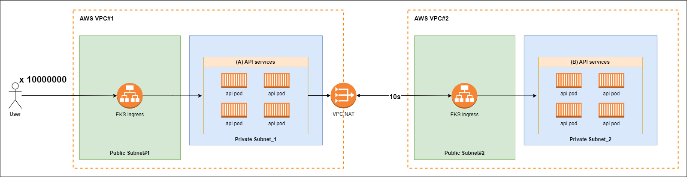

본 글은... 아래 질문에 대한 궁금증으로 작성하게 되었습니다.

> 만약 초당 수천만건의 API 요청이 들어오며, 해당 API가 외부 API로 통신하는 환경에서 외부 API의 응답이 10초라면 서버는 어떻게 되는가? 
> 
> ⨳ TCP connection timeout은 별도로 설정되어 있지 않다고 가정한다

# 고루틴이 무엇인가?
고루틴을 흔히 경량 스레드라고 부른다... 그래서 스레드인데 메모리만 낮은 스레드라는 건가?

## 고루틴의 장점
### 낮은 컨텍스트 스위칭 비용
하드웨어가 발전함에 따라 이를 효율적으로 사용하기 위해 *_멀티스레딩_과 *_멀티태스킹_ 개념이 등장한다.
> 멀티스레딩 : 하나의 프로세스 안에서 여러 스레드 실행
>
> 멀티태스킹 : 여러 작업을 동시에 실행되는 것처럼 보여줌

#### 타 언어(C/C++/Java)


#### Go언어
Go 런타임은 커널 수준의 TCB(Task Control Block)를 직접 스위칭하지 않고, 자체적인 G(고루틴), M(OS Thread), P(Scheduler Context)를 활용한 **경량 컨텍스트 스위칭**을 수행한다

----

### 생성 및 소멸 비용
`OS Thread`를 생성하고 모두 사용한 뒤에 소멸하는 작업은 높은 비용을 요구한다. 이러한 비용 지불을 매번 하지 않기 위해 **스레드 풀**을 사용하기도 한다

Go언어에서는 어떨까?

Go 런타임의 GMP 모델 M이 바로 `OS Thread`에 해당된다. P(processor)가 M과 연결되어 고루틴이 수행되는 과정에서 M 또한 새롭게 생성되거나 소멸될 수 있다. 

하지만 이는 go 런타임 스케쥴러에 의해 최적화되기에 일반적인 프로그래밍 언어에 비해 훨씬 저비용으로 관리가 가능해진다

----

### 적은 메모리 소비
스레드로 생성할 경우, 스레드 간 메모리 보호 역할을 하는 공간을 포함하여 `1MB` 정도의 스택을 필요로 한다.

반면에 고루틴은 `2KB`의 스택만 필요하기에 엄청난 경량 효과를 보게 된다 (물론 어떤 코드를 고루틴으로 돌리느냐에 따라, 메모리가 추가적인 할당이 필요함. 이는 다른 언어도 마찬가지)

수치로 비교하자면 다음과 같다
| 언어    | 기본 실행 단위         | 기본 스택 크기 | 총 메모리 소비 추정 |
| ----- | ---------------- | -------- | ----------- |
| C/C++ | pthread          | 8MB      | 약 8MB 이상    |
| Java  | java.lang.Thread | 1MB      | 약 1MB 이상    |
| Go    | goroutine (G)    | 2KB (초기) | 수 KB 수준     |

----

# GMP
Go런타임은 모든 고루틴을 다중화된 스레드들에 할당하고 모니터링하며, 효율적으로 최적화된 스케쥴링을 진행한다.


구성 요소는 다음과 같다. 자세한 구조체는 [runtime.runtime2.go](https://github.com/golang/go/blob/master/src/runtime/runtime2.go) 참고
| 구성 요소                      | 의미       | 역할         | 주요 정보                                             |
| -------------------------- | -------- | ---------- | ------------------------------------------------- |
| **G (Goroutine)**          | 고루틴      | 실행 단위      | 스택 포인터, 고루틴 상태 등 컨텍스트 정보 보유/LRQ 또는 GRQ에 대기     |
| **M (Machine)**            | OS 스레드   | 고루틴 실행     | 실행 중인 고루틴(G), 연결된 P, 스레드 핸들 정보 보유                 |
| **P (Processor)**          | 논리 프로세서  | 고루틴 스케줄링   | 최대 `GOMAXPROCS` 개 존재/자신의 LRQ로부터 G를 POP하여 M에 할당 |
| **LRQ (Local Run Queue)**  | 지역 실행 큐  | 고루틴 큐 (P별) | 각 P에 하나씩 존재<br>G를 M에 할당/경쟁 조건 줄이기 용이           |
| **GRQ (Global Run Queue)** | 글로벌 실행 큐 | 고루틴 큐 (공용) | 모든 P가 공유/LRQ가 가득 찼거나 실행 시간 초과된 G가 들어감          |


## P (Processor)
- P는 기본값으로 `GOMAXPROCS`=(CPU Core)를 가짐
- P는 하나의 M에 할당되며 각 P는 자신의 `Local Run Queue`를 지님
- P는 G의 context 정보를 갖는다 
- `findRunnable()`을 호출하여 다음 실행 될 G를 결정함


[[runtime/proc.go](https://go.dev/src/runtime/proc.go)]
```go
func findRunnable() (gp *g, inheritTime, tryWakeP bool) {
    mp := getg().m
    pp := mp.p.ptr()

    // local runq
    if gp, inheritTime := runqget(pp); gp != nil {
        return gp, inheritTime, false
    }

    // global runq
    if sched.runqsize != 0 {
        lock(&sched.lock)
        gp := globrunqget(pp, 0)
        unlock(&sched.lock)
        if gp != nil {
            return gp, false, false
        }
    }

    // Poll network.
    if netpollinited() && netpollAnyWaiters() && sched.lastpoll.Load() != 0 {
        if list, delta := netpoll(0); !list.empty() {
            gp := list.pop()
            injectglist(&list)
            netpollAdjustWaiters(delta)
            casgstatus(gp, _Gwaiting, _Grunnable)
            return gp, false, false
        }
    }

    // Spinning Ms: steal work from other Ps.
    if mp.spinning || 2*sched.nmspinning.Load() < gomaxprocs-sched.npidle.Load() {
        if !mp.spinning {
            mp.becomeSpinning()
        }

        gp, inheritTime, _, _, _ := stealWork(nanotime())
        if gp != nil {
            return gp, inheritTime, false
        }
    }

    // fallback: no G found
    return nil, false, false
}
```

| 순서 | 소스                            | 설명                                | 사용 상황                        |
| -- | ----------------------------- | --------------------------------- | ---------------------------- |
| ①  | **Local Run Queue (LRQ)**     | P마다 존재하는 고유 큐                     | 가장 빠르고 비용이 적음 → **우선 선택 대상** |
| ②  | **Global Run Queue (GRQ)**    | 모든 P가 공유하는 큐                      | LRQ가 비어있을 때 fallback         |
| ③  | **Network Poller (Netpoll)**  | epoll/kqueue/I/O 이벤트로 wake-up된 G들 | 네트워크 I/O 완료 후 G를 되살리는 역할     |
| ④  | **Work Stealing (다른 P의 LRQ)** | 다른 P의 LRQ에서 G를 훔쳐옴                | 자신이 빈 상태이고 GRQ도 비어 있을 때 수행   |

그럼 자연스럽게 이런 생각이 들 것이다.. 

----

#### I/O 작업을 하는 경우 LRQ와 GRQ가 모두 소비된 후에야 처리될 수 있을까?
우선 아니다. 대표적으로 아래 경우에 netpoll queue에서 GRQ로 inject 된다

*_sysmon()_ 시스템 모니터 내부
> sysmon : 독립적으로 백그라운드에서 반복 실행하며, P/M/Netpoll 하여 스케쥴링

[[runtime/proc.go](https://go.dev/src/runtime/proc.go)]
```go
func sysmon() {
    for {
        ...
        if netpollinited() {
            list, _ := netpoll(0) // 비차단
            injectglist(&list)
        }
        ...
    }
}
```

----

#### Blocking 작업 완료 후, G는 어떻게 다시 P에게 돌아가는가?
하나의 P(processor)에서 `goroutine` 스위칭 과정이다

G1은 syscall을 수행하는 고루틴이다 (ex. `HTTPRequest`)


| 단계                              | 설명                                         |
| ------------------------------- | ------------------------------------------ |
| ① `G1`이 syscall 진입              | `net.Read()` 호출                         |
| ② `M1`은 syscall에 block          | `entersyscall()` 호출, `P1` 분리됨              |
| ③ `P1`은 `M2`에게 전달됨              | `M2`가 idle 상태거나 `newm()`으로 새로 생성됨          |
| ④ `M2`는 G2를 선택하고 실행             | P1의 run queue에서 G2를 선택해 실행                 |
| ⑤ OS에서 syscall 완료 감지            | `epoll`, `kqueue`, IOCP 등에 의해              |
| ⑥ `netpoller`가 G1을 runnable로 마킹 | `G1.status = _Grunnable`, run queue에 다시 등록 |
| ⑦ 스케줄러가 적절한 시점에 G1을 재실행         | 이후 `schedule()`에서 G1이 선택되면 재개됨             |

----

#### findRunnable에서 Runnable한 Goroutine이 없다면?
1. 현재 M(OS thread)은 더 이상 실행할 G가 없음
2. stopm() 호출 → 현재 M은 park
3. M이 보유하던 P는 releasep()를 통해 반납됨
4. 반납된 P는 idle P 큐에 들어감

- `GOMAXPROCS` 개수만큼 생성된 P는 사라지지 않고 idle 상태 유지
- 새로운 runnable G가 나타나면, idle한 P를 다시 획득하여 실행 재개
- M도 필요 시 다시 생성되거나 idle M을 재사용

----

## M (Machine)
- M은 G를 받아 실제 수행을 수행하는 `OS Thread`이다
- maxcount는 기본값으로 **10000**

앞선 P가 Blocking 작업 고루틴으로 수행하는 경우 M1의 운명은? (syscall 실행 이후의 흐름)

[[runtime/proc.go](https://go.dev/src/runtime/proc.go)]
```go
func exitsyscall() {
	gp := getg()

	// Validate syscall stack frame
	if sys.GetCallerSP() > gp.syscallsp {
		throw("exitsyscall: syscall frame is no longer valid")
	}

	gp.waitsince = 0
	oldp := gp.m.oldp.ptr()
	gp.m.oldp = 0

	// Fast path: try to reacquire P and resume execution
    // if P is IDLE, return true and resume running goroutine
	if exitsyscallfast(oldp) {
		...
		casgstatus(gp, _Gsyscall, _Grunning) // mark G as running
		return
	}

	// Slow path: failed to reacquire P
    // Call scheduler (park M and let scheduler run G later)
	mcall(exitsyscall0) 
}
```

| 조건              | 처리                                          |
| --------------- | ------------------------------------------- |
| P를 reacquire 가능 | G1 즉시 실행 (`execute(g)`)                     |
| P를 못 얻음         | G1은 runnable로 enqueue, M1은 stop (`stopm()`) |
| M이 많고 idle    | M1은 완전히 종료될 수도 있음                           |
| M이 부족하면서 idle        | M1은 다시 사용될 수도 있음 (`newm()` 피함)              |

----

### 다른 언어에서의 M(OS Thread)을 통한 멀티스레딩
- 매 요청마다 1개의 OS 스레드를 생성하고, 해당 스레드에서 `epoll_wait/syscall` 수행
- N개의 워커 스레드를 만들어 각기 `epoll_wait` 또는 `read` 처리

#### Cons
- 1000개의 동시 요청을 처리하려면 **최대 1000개의 스레드가 필요**
- 각각의 M(epoll_wait)은 syscall blocking이므로 context switch 발생
- *_캐시 미스_, 커널 진입 비용, 스케줄링 오버헤드 등이 급증
> 캐시 미스 : Context Switch 이후, CPU 캐시에서 자신의 데이터가 없음 → 메모리에서 다시 로드 (느림)

### Netpoller M

Netpoller M은 Go 런타임이 하나만 유지하는 전용 OS 쓰레드(M)로, `epoll/kqueue` 등의 커널 I/O readiness 감시 시스템과 연결되어 있다
- 고루틴들이 non-blocking I/O(fd)를 사용할 때, 해당 fd의 **readable/writable 상태를 감시**하는 역할만 전담
- 하나의 M만으로 수천 개의 fd를 감시, 적은 자원으로 수많은 I/O 고루틴을 효율적으로 처리

> 두 개의 syscall을 포함하는 고루틴과 Netpoller M의 flow


----

#### 왜 M이 바로 syscall 하면 안되는 거죠?
> Example : G1이 TCP 소켓을 통해 `conn.Read()`를 호출했다고 가정
> 만약 상대방이 갑자기 죽거나, NAT 타임아웃 등으로 연결이 끊겼는데도
> 커널에서 EOF 신호를 전달하지 않는다면?

- `read(fd)` syscall은 영원히 반환되지 않는다 (block 상태 지속)
- G1을 실행한 M은 syscall에서 block
- 해당 M이 보유한 P도 함께 릴리즈되면서 전체 병렬성에 영향

이러한 이유로 Go는 고루틴이 syscall 전에 fd의 readiness를 epoll 등을 통해 확인하고, 실제 `read()`는 ready일 때만 호출한다

#### 왜 Netpoller M이 전담해서 epoll하나요?
> Example : 1000개의 M이 각자 `epoll_wait(fd)`를 호출

- 1000개가 제각각 `epoll_wait()`
- epoll 또한 syscall로, 커널-유저 전환 오버헤드 존재
- 얼마의 주기로 epoll 할것인가? polling interval도 추가로 고려해야 함

## G (Goroutine)

### Goroutine 스케쥴링
고루틴이 어떠한 흐름으로 실행되는지 살펴봅시다
>`go dosomething()`을 통해 신규 고루틴을 생성하게 되었습니다.
> 
> **현재 상태**
> - LRQ가 가득 참
> - 신규 고루틴 생성됨


1. 신규 고루틴(G0)이 생성되어 좌측 P에게 LRQ의 공간이 있는지 확인한다 
2. 현재 P의 LRQ가 full인 상태이다 (실제 상황에서는 lrq size = 256)

3. 기존 LRQ의 반을 GRQ에 삽입한다 (G2 → GRQ)
4. G0은 P가 비었기 때문에 LRQ로 삽입된다

5. G1이 수행되고 G0이 `runnext`에 위치한다
6. LRQ가 비었으므로 GRQ에서 고루틴을 가져온다 (`global runqueue의 현재 길이/GOMAXPROCS + 1` 만큼)

7. G0은 M에서 실행되며 소켓에 요청을 전송한다
8. G0은 `epoll_ctl(..., EPOLLIN)`을 통해 readiness 등록한다

9. blocking 되지 않도록 기존 P와 연결을 끊는다
10. Netpoller M은 `epoll_wait`을 통해 readiness fd를 확인한다

11. M은 IDLE 상태로 돌아가며 G0은 `Gopark`로 대기한다 (이후 스케쥴러에 의해 삭제 혹은 P와 다시 맺어줌)
12. Netpoller M은 G0 fd의 readiness fd를 확인한다

13. Netpoller M은 G0 fd의 readiness를 확인하고 Goready 상태로 전환한다
14. P는 LRQ와 GRQ에서 G를 찾지만 더이상 소비할 G가 없다

15. P는 `netpoll`으로 Ready 상태인 G를 바로 가져와 실행한다

## 몇몇 유의사항
### GRQ Starvation 
- LRQ만 계속 확인하고 GRQ polling이 일어나지 않을 수 있다.
- schedTick 변수가 존재하여, 61번의 polling이 일어날 때마다 LRQ → GRQ 순으로 확인하지 않고 GRQ를 먼저 확인하여 polling한다.
- schedTick 값이 61인 이유는 일단 실험적으로 성능이 좋았던 값의 범위 안에서 prime number를 고른 것이다. prime number를 사용한 이유는 hash map에서 균일 분포를 위해 prime length를 사용하던 것과 마찬가지로 어플리케이션 패턴과의 충돌을 피하기 위함이다.


[[runtime/proc.go](https://go.dev/src/runtime/proc.go)]
```go
func findRunnable() (gp *g, inheritTime, tryWakeP bool) {
    mp := getg().m
    pp := mp.p.ptr()

    // Check the global runnable queue once in a while to ensure fairness
	// Otherwise two goroutines can completely occupy the local runqueue
	// by constantly respawning each other.
	if pp.schedtick%61 == 0 && !sched.runq.empty() {
		lock(&sched.lock)
		gp := globrunqget()
		unlock(&sched.lock)
		if gp != nil {
			return gp, false, false
		}
	}

    // local runq
    if gp, inheritTime := runqget(pp); gp != nil {
        return gp, inheritTime, false
    }
    ...
}
```

### Time slice based preemption
하나의 고루틴이 프로세서를 오래 점유하는 것을 막기 위해 기본 10ms의 time slice가 정의되어 시간을 넘겼을 때 실행 중이던 고루틴은 preempted되어 GRQ로 들어간다.

[[runtime/proc.go](https://go.dev/src/runtime/proc.go)]
```go
func sysmon() {
	...
	for {
		...

		lock(&sched.sysmonlock)
		now = nanotime()

		...

		// retake P's blocked in syscalls
		// and preempt long running G's
		if retake(now) != 0 {
			idle = 0
		} else {
			idle++
		}

		...
		unlock(&sched.sysmonlock)
	}
}
```

# 수천만건의 네트워크 I/O를 수행하는 작업이 있는 경우 어떻게 되는가?
Go의 고루틴은 경량 컨텍스트 스위칭, 작은 메모리 점유, epoll 기반의 네트워크 폴링 구조 덕분에 대규모 네트워크 I/O 환경에서도 효율적으로 작동할 수 있다. 

그러나 외부 API의 응답이 매우 느린 경우 (예: 10초), 그리고 초당 수천만 건의 요청이 쏟아지는 상황에서는 몇 가지 중요한 병목과 리스크가 발생할 수 있다.

## 발생 가능 에러 케이스
### 1. 고루틴 수의 폭발적 증가
- 모든 요청이 외부 API 호출을 포함하고 있고, 이 API가 10초 이상 block 된다면, 10초 동안 고루틴이 대기 상태로 남음
- 초당 1,000만 건의 요청이 들어오고 10초 응답이라면, 최대 1억 개의 고루틴이 동시에 존재
- 고루틴 하나당 초기 스택이 2KB라고 가정해도, 1억 × 2KB ≒ 200GB 이상의 메모리를 소비
- 고루틴 수가 너무 많아지면 시스템 메모리가 고갈

### 2. file descriptor(fd) 수 제한
- 외부 API와 통신하는 각 요청은 TCP 연결을 맺기 때문에, OS는 각각의 fd를 유지
- 리눅스에서는 기본적으로 ulimit -n(open files 수)이 수천~수만 개로 제한됨
- 초당 수천만 건의 연결 요청은 결국 `fd exhaustion` 문제로 새로운 네트워크 요청이 실패하게 됨

----

## 고루틴 1억 개 돌려도 괜찮을까? 테스트
```go
func init() {
	http.HandleFunc("/slow", func(w http.ResponseWriter, r *http.Request) {
		time.Sleep(10 * time.Second)
	})
	go func() {
		log.Println("slow API server start in :18080")
		http.ListenAndServe(":18080", nil)
	}()
}

func main() {
	// ===== trace start =====
	traceFile, err := os.Create("trace.out")
	if err != nil {
		log.Fatalf("trace file creation failed: %v", err)
	}
	if err := trace.Start(traceFile); err != nil {
		log.Fatalf("trace start failed: %v", err)
	}
	defer func() {
		trace.Stop()
		traceFile.Close()
	}()
	// =====================

	startProfiler() // start profiler

	for i := 0; i < 100000000; i++ {
		go func(i int) {
			client := &http.Client{}

			resp, err := client.Get("http://localhost:18080/slow")
			if err != nil {
				fmt.Printf("[%d] Error: %v\n", i, err)
				return
			}
			io.Copy(io.Discard, resp.Body)
			resp.Body.Close()
		}(i)

		if i%100000 == 0 {
			fmt.Printf(
				"Current Request Count: %d, Goroutine Count: %d\n",
				i,
				runtime.NumGoroutine(),
			)
		}
	}

	select {} // wait forever (trace cancels from defer)
}
```
- fd 재사용을 막기 위해 `http.Client`를 매번 생성하여 HTTP 요청
- API 서버에서는 10초의 delay가 있다고 가정
- heap / cpu 프로파일링 활성화


----


### heap profile


`net/http.(*Transport).getConn`
- 내부적으로 HTTP connection pool을 관리하면서, 새로운 연결을 만들거나 재사용하는 함수
- connection을 재사용하지 못함 → 계속 dial → new FD → getConn → heap 사용 증가

`runtime.malg`
- Go 런타임이 고루틴을 생성할 때 사용하는 stack 및 G 구조체 메모리
- 서버 응답을 기다리는 Waiting 상태의 고루틴 증가 → GC는 사용 중인 goroutine stack을 해제할 수 없음 → runtime.malg 급증

----

### cpu profile


`runtime.cgocall`
- Go에서 C 코드 또는 시스템 호출 (syscall) 을 실행할 때 사용되는 내부 함수
- 수많은 고루틴이 동시에 `http.Client.Get()`을 호출 → 각 요청마다 새로운 연결을 시도 → 네트워크 syscall 폭주

`runtime.(*timers).adjust`
- Go의 타이머 시스템은 내부적으로 min heap 기반으로 동작
- 테스트 코드 중, `time.Sleep`이 각 고루틴 별로 수행 → 수십만 개의 타이머가 힙에 삽입되어 힙 정렬 (adjust) 연산이 반복

---


정리하자면, blocking 되는 처리를 대기하는 고루틴이 무한히 증가하면? → 종료되지 않은 고루틴의 Heap 점유 → OOM으로 Server Down

번외로 동일한 커넥션을 만들도록 설정하더라도...

```go
func main() {
	...
    client := &http.Client{
		Transport: &http.Transport{
			MaxIdleConns:        10000, // 전체 idle 연결 수
			MaxIdleConnsPerHost: 10000, // 호스트당 idle 연결 수
			IdleConnTimeout:     90 * time.Second,
			DisableKeepAlives:   false,
		},
		Timeout: 30 * time.Second,
	}
	for i := 0; i < 100000000; i++ {
		go func(i int) {
			...
		}(i)

		...
	}

	select {} // wait forever (trace cancels from defer)
}
```
OOM으로 인해 Server Down된다


- waiting 중인 goroutine의 heap 점유
- connection pool을 초과하는 경우, new connection → getConn → heap 사용 증가
- runnable 상태의 goroutine의 스케쥴링 과정에서 CPU 폭주

# REFS
- [Dmitry Vtukov](https://www.youtube.com/watch?v=-K11rY57K7k)
- [GopherCon 2021: Madhav Jivrajani - Queues, Fairness, and The Go Scheduler](https://velog.io/@sunaookamisiroko/Goroutine-%EC%8A%A4%EC%BC%80%EC%A4%84%EB%A7%81)
