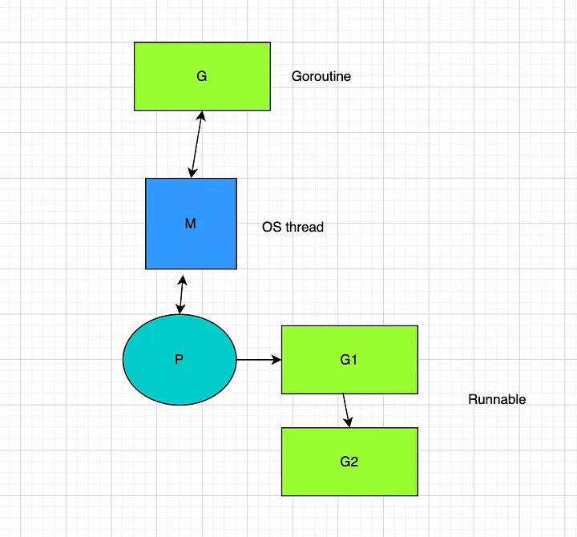

# Golang Channels: 철학과 메커니즘

채널이란? 고루틴 간에 데이터를 안전하게 주고받기 위한 파이프라인 (= 고루틴 간의 통신 도구)


Golang이 가장 큰 장점인 '동시성'을 제대로 활용하기 위해서는, 채널이라는 개념을 잘 이해하는 것이 중요!


## 1. 채널의 철학: CSP(Communicating Sequential Processes)

> **"공유 메모리보다 메시지를 공유하라."**

Go의 채널은 CSP 이론에 기반한 동시성 설계 철학을 반영합니다.

* CSP는 **프로세스 간의 통신을 메시지 기반**으로 처리합니다.
* 전통적인 공유 메모리 방식과 달리, 고루틴 간 직접 접근 없이 채널로만 데이터를 주고받습니다.


## 1.1 ⚔️ CSP vs Shared Memory Concurrency

Go는 CSP 모델을 채택했지만, 전통적인 시스템은 공유 메모리 기반의 동시성을 사용합니다.

### 📦 CSP (Communicating Sequential Processes)

* **핵심 아이디어**: 데이터를 고루틴끼리 공유하지 않고, 채널을 통해 메시지를 전달함
* **접근 방식**: 고루틴 간 직접적인 공유 상태가 없음
* **대표 언어/환경**: Go (채널 기반), Erlang (메시지 패싱)

```go
// Go 예시 - CSP 스타일
ch := make(chan int)

go func() {
    ch <- 42
}()

val := <-ch
fmt.Println(val)
```

```text
Goroutine A                 채널(hchan)                    Goroutine B
------------                ------                   ------------
   ch <- 42       ─────▶   sendq.push()  
   (blocked)               recvq.peek()             <- ch
                           ─────▶ 42 값 복사        fmt.Println(42)
                           sendq.pop()
                           goready(sender)
```
* 채널 내부 버퍼에 값이 복사되어, 이 복사된 값을 고루틴 B가 조회하기 때문에 공유 메모리가 사용되지 않음
* peek() : 현재 **대기 중**인 송신자/수신자 고루틴이 존재하는지 확인
* goready() : 수신자를 실행 가능한 상태로 깨움 (즉시 실행은 아님)
   * 즉시 실행이 아닌 이유?
       * Go의 고루틴은 OS 스레드에 바로 연결되지 않고, **M:N 스케줄러**에 의해 관리되기 때문
       * 즉 고루틴을 'Runnable 상태'로 만들어, 유휴 상태인 스레드가 있을 경우 스케줄러가 해당 고루틴을 선택하도록 함

### 🧠 Shared Memory (공유 메모리 동시성)

* **핵심 아이디어**: 여러 스레드가 동일한 변수나 메모리 공간에 접근하여 상태를 공유
* **접근 방식**: `mutex`, `atomic`, `condition variable` 등을 사용해 **경합을 제어**
* **대표 언어/환경**: C/C++, Java, Python (스레드 기반)

```java
// Java 예시 - 공유 메모리 스타일
class Counter {
    private int value = 0;

    synchronized void increment() {  // 코드 레벨에서 lock을 걸어 하나의 스레드만 전역변수를 참고하도록
        value++;
    }

    synchronized int get() {
        return value;
    }
}
```

### 🔍 비교
```text
                [ CSP - Communicating Sequential Processes ]

┌──────────────┐       send(42)       ┌──────────────┐       receive
│ Goroutine A  │ ───────────────────▶ │  chan int    │ ───────────────────▶ Receiver
│   (Sender)   │                     │ [   42   ]   │                     (Goroutine B)
└──────────────┘                     └──────────────┘
```
```text
                [ Shared Memory - Mutual Exclusion ]

    ┌──────────────┐                       ┌──────────────┐
    │  Thread A    │                       │  Thread B    │
    │  (Writer)    │                       │  (Reader)    │
    └──────┬───────┘                       └──────┬───────┘
           │                                        │
           │ Lock(mutex)                            │
           ▼                                        │
     ┌────────────────┐                ┌────────────┴────────────┐
     │ Writing to      │               │  🚫 Blocked: waiting    │
     │ Shared Variable │               │     for lock            │
     │ value = 42      │               └─────────────────────────┘
     └────────────────┘                           ▲
           │                                      │
           │ Unlock(mutex)                        │
           ▼                                      │
                                             Lock(mutex)
                                                  ▼
                                        ┌────────────────────┐
                                        │ Reading value = 42 │
                                        └────────────────────┘

```

### ✅ Go에서의 선택 이유

> Go는 CSP를 통해 **단순하고 예측 가능한 동시성 제어**를 제공하려 했습니다. 고루틴과 채널을 사용하면 “무엇을” 공유하는지보다 “언제” 통신하는지에 집중할 수 있게 됩니다.

---

## 1.2 Go에서 채널이 존재하는 이유

### 📌 왜 채널이 필요한가?
* 고루틴은 수천 개 이상 동시에 실행될 수 있으므로 **효율적인 통신 방법**이 필요함
* 전통적인 락 기반 동기화는 코드 복잡도와 디버깅 난이도가 큼
* 채널은 **고루틴 간 통신을 안전하고 명시적으로** 처리할 수 있게 해줌

### ✅ 채널의 장점
* 고루틴 간 안전한 통신
* 복잡한 뮤텍스 없이 직관적인 설계
* 흐름 중심 프로그래밍 (비즈니스 로직을 동기적으로 표현 가능)
* select 문을 통한 고급 이벤트 처리

### ⚠️ 채널의 단점
* 무분별한 사용 시 성능 저하 (예: 많은 블로킹 발생)
* 복잡한 상황에서는 뮤텍스보다 비효율적일 수 있음
---


## 2. 채널 종류 및 사용법

| 채널 종류     | 선언 방식                       | 특징 및 사용 예시                             |
| --------- | --------------------------- | -------------------------------------- |
| 기본 채널     | `make(chan int)`            | **unbuffered**: 송수신자가 동시에 준비되어야 작동     |
| 버퍼드 채널    | `make(chan int, 3)`         | **buffered**: 버퍼 용량만큼 송신자 블로킹 없이 전송 가능 |
| 수신 전용 채널  | `var ch <-chan int`         | 오직 **수신만 허용**되는 채널                     |
| 송신 전용 채널  | `var ch chan<- int`         | 오직 **송신만 허용**되는 채널                     |
| nil 채널    | `var ch chan int // 초기화 안함` | 송수신 모두 **영원히 블로킹**          |
| closed 채널 | `close(ch)`                 | 수신자는 zero value 리턴, 송신자는 panic 발생      |

#### closed 채널 추가 설명 
```go
ch := make(chan int, 1)
ch <- 100
close(ch)

val1, ok1 := <-ch
fmt.Println(val1, ok1) // 👉 100 true

val2, ok2 := <-ch
fmt.Println(val2, ok2) // 👉 0 false
```

### 송신/수신 블로킹 조건
* **unbuffered**: 수신자가 없으면 송신자는 블록됨 (반대도 동일)
* **buffered**: 버퍼가 가득 차면 송신자 블록됨, 비어 있으면 수신자 블록됨
 

### `select` 문
```go
select {
  case msg1 := <-ch1:
    fmt.Println("Received:", msg1)
  case msg2 := <-ch2:
    fmt.Println("Received:", msg2)
  default:
    fmt.Println("no activity")
}
```
* case문 하나 만족 시 select문 종료
* 만약 ch1, ch2 채널에 값이 동시에 수신되는 경우 두 case문 중 하나 **랜덤**으로 수행됨
* default가 없으면 가능한 case가 생길 때까지 블로킹
* default가 있으면 non-blocking select
---


## 3. 채널 내부 구현 ([runtime/chan.go](https://go.dev/src/runtime/chan.go) 기반 분석)

Go 채널은 내부적으로 `hchan`이라는 구조체로 표현됩니다.

### hchan 주요 필드

```go
// 채널
type hchan struct {
    qcount   uint           // 큐에 저장된 요소 수
    dataqsiz uint           // 버퍼 크기
    buf      unsafe.Pointer // 버퍼 시작 주소
    elemsize uint16         // 요소 크기
    closed   uint32         // 채널 닫힘 여부
    sendq    waitq          // 송신자 큐
    recvq    waitq          // 수신자 큐
    lock     mutex          // 락
}

type waitq struct {
	first *sudog
	last  *sudog
}

// 대기 중인 고루틴
type sudog struct {
    g        *g          // 연결된 고루틴
    next     *sudog      // 대기열에서 다음 대기자
    prev     *sudog      // 대기열에서 이전 대기자

    elem     unsafe.Pointer // 송수신할 값의 위치
    acquiretime int64       // 트레이싱용 시간 정보

    isSelect bool       // select 문 안에서 대기 중인지 여부
    success  bool       // select에서 해당 case가 선택되었는지 여부

    c        *hchan     // 연결된 채널 (chan pointer)
    parent   *sudog     // G 파킹 시 사용
}

```


* (송/수신) 큐에는 큐의 첫번째와 맨 마지막 고루틴 정보만 저장해두고 있음
* 고루틴 구조체(sudog)는 prev, next 고루틴을 가진 **양방향 연결리스트** 형태로 구현되어 있음

### sudog 활용
* 고루틴이 ch <- v 또는 <-ch 로 블로킹될 때 sudog로 래핑됨 (채널 대기 고루틴)
* 채널 내부의 sendq / recvq 는 sudog로 이루어진 FIFO 큐
* 채널 이벤트가 발생하면 goready(sudog.g)로 고루틴을 깨움

### 주요 함수 설명
* chansend()
* chanrecv()


### chansend() : 채널 송신 처리
#### 예시 코드
```go
ch := make(chan int, 50)
ch <- 42  // 호출 시, 런타임 과정에서 chansend() 수행됨
```

1. 채널이 nil 상태인지 체크
2. 수신자 (`recvq`) 대기 중이면 (bufSize=0)
     * 버퍼 사용 없이, 값을 다이렉트로 수신자 메모리 공간에 직접 전달
     * `goready()`를 통해 수신자 고루틴을 실행 가능 상태로 변경
3.  수신자 없음 + 버퍼 여유 있는 경우 (bufSize>0)
      * 버퍼에 값 저장
4. 수신자도 없고, 버퍼도 가득 차 있으면:
     * `sudog` 생성 → `sendq`에 enqueue → `gopark()`로 블로킹

```go
// runtime/chan.go
func chansend(c *hchan, ep unsafe.Pointer, block bool, callerpc uintptr) bool {
    if c == nil {
        // nil 채널이면 블로킹 or 즉시 리턴
        if !block {
		return false
	}
	gopark(nil, nil, waitReasonChanSendNilChan, traceBlockForever, 2)
    }

    if !block && c.closed == 0 && full(c) {
		// 논블로킹 모드에서 채널이 닫히지 않고 가득 찼을 때, 즉시 리턴
		return false
	}

    if sg := c.recvq.dequeue(); sg != nil {
        // 수신자가 대기 중이면 버퍼 사용 없이, 수신자 메모리 공간에 값을 직접 전달
        send(c, sg, ep)
        goready(sg.g)  // 수신자 고루틴 실행 가능 상태로 변경
        return true
    }

    if c.qcount < c.dataqsiz {
        // 수신자가 없음 + 버퍼에 여유 공간 있음 : 버퍼에 값 저장
        typedmemmove(c.elemtype, chanbuf(c, c.sendx), ep)
        c.sendx++   // 송신 인덱스 증가
        c.qcount++  // 버퍼에 저장된 값 개수 증가
        return true
    }

    // 수신자도 없고, 버퍼도 가득 차 있는 상태 -> 값이 비워지기 전까지 블락
    // gospark를 통해 송신자를 블락 상태로 변경
    sg := acquireSudog()
    sg.g = getg()
    sg.elem = ep
    sg.c = c
    c.sendq.enqueue(sg)
    gopark(chanparkcommit, unsafe.Pointer(&c.lock), waitReasonChanSend, traceBlockChanSend, 2)
    return sg.success
}

// 리턴값
// true: 송신이 성공적으로 완료됨
// false: 송신이 실패했거나, 블로킹 허용하지 않았고 채널이 준비되지 않음
```

#### 추가 설명
논블로킹 모드에서 채널이 닫히지 않고 가득 찬 경우
```go
ch := make(chan int, 1)
ch <- 1 // 채널이 꽉 참

select {
case ch <- 2: // full + non-blocking + not closed
    fmt.Println("sent")
default:
    fmt.Println("failed to send") // ✅ 여기가 실행됨
}
```

### 잠시! 이 리턴값은 어떻게 활용되는 것이며, 위 함수는 어디에서 호출되는 것인지?
```go
select {
  case msg1 := <-ch1:
    fmt.Println("Received:", msg1)
  case msg2 := <-ch2:
    ...
}
```
* select문 수행 시, 런타임에서 `selectgo()` 함수를 수행해 모든 케이스마다 채널 함수(chansend, chanrecv)를 호출하여 연산 결과가 true/false인지 체크
* 처음에 모든 케이스들을 다 체크한 후 true인 케이스가 하나도 없다면 gopark()를 통해 블락됨
* 이후 만족하는 case가 생길 경우, gospark로 블락된 고루틴을 깨워 case문이 수행되도록 진행됨


### chanrecv() : 채널 수신 처리
```go
chVal := <-ch  // 호출 시, 런타임 과정에서 chanrecv() 수행됨
```

1. 채널이 nil 상태인지 체크
2. `sendq`에 대기중인 송신자가 존재하는지 (bufSize=0)
      * 버퍼 사용 없이 값을 직접 전달 받음
      * `goready(sender.g)`로 송신자 깨움
3. 대기 송신자 없음 + 버퍼에 값이 존재하는 경우 (bufSize>0)
      * 버퍼에서 값 읽음
4. 아무도 없다면:
      * `sudog` 생성 → `recvq`에 enqueue → `gopark()`로 블로킹

```go
// runtime/chan.go
func chanrecv(c *hchan, ep unsafe.Pointer, block bool) (selected, received bool) {
    // nil 채널은 송수신이 절대 불가능하므로 진행 불가 → 비블로킹이면 실패 처리
    if c == nil {
        if !block {
            return
        }
        gopark(nil, nil, waitReasonChanReceiveNilChan, traceBlockForever, 2)
    }

    // Fast path: 논블로킹 모드인데 채널이 비워있는 경우, 고성능을 위해 즉시 리턴
    if !block && empty(c) {
		if atomic.Load(&c.closed) == 0 {
			return
		}
		if empty(c) {
			if raceenabled {
				raceacquire(c.raceaddr())
			}
			if ep != nil {
				typedmemclr(c.elemtype, ep)
			}
			return true, false
		}
    }

    if sg := c.sendq.dequeue(); sg != nil {
        // 송신자가 대기 중이면 직접 값 복사 후, 송신자 깨움
        // 버퍼 사이즈가 0인 경우, 수신자가 받을 때까지 송신자는 블락되기 때문에 goready를 통해 깨워주는 작업이 필요
        recv(c, sg, ep)
        goready(sg.g)
        return true, true
    }

    if c.qcount > 0 {
        // 대기 송신자 없음 + 버퍼에 값이 존재하는 경우, 버퍼에서 값 읽음
        typedmemclr(c.elemtype, qp)
        c.recvx++
        c.qcount--
        return true, true
    }

    // 버퍼가 비어 있는 경우, 수신자 대기 등록
    sg := acquireSudog()
    sg.g = getg()
    sg.elem = ep
    sg.c = c
    c.recvq.enqueue(sg)
    gopark(chanparkcommit, unsafe.Pointer(&c.lock), waitReasonChanReceive, traceBlockChanRecv, 2)
    return sg.success, sg.success
}

```

---


## 4. Go 런타임 스케줄러


* Go에서 고루틴은 Go 런타임 스케줄러가 관리하는 **사용자 공간** 스레드
* 운영 체제 스레드와 달리 고루틴의 수명 주기는 운영 체제 자체가 아닌 **Go 런타임에서 관리** 
    * 이러한 차이점 덕분에, 고루틴은 OS 스레드보다 가벼워 리소스 소비가 적고 스케줄링 오버헤드도 줄어듬
* Go 런타임 스케줄러는 **M:N 스케줄링 모델**을 사용
    * M : 고루틴의 개수
    * N : 운영 체제 스레드의 개수
* 이를 통해 스레드가 아닌 고루틴 자체를 컨텍스트 스위칭하여 병렬 처리를 효율적으로 지원할 수 있게 됨




Go schedular에는 세 가지 구조가 존재합니다.
* M은 운영체제 자체에서 관리하는 OS 스레드
* G는 크기 조절이 가능한 스택인 고루틴
* P는 스케줄링을 위한 컨텍스트를 나타내며 Go 코드 실행을 담당하며, 실행 가능한 고루틴의 큐를 포함하고 있음 (스케쥴링 담당 주체)


gopark()시 스케줄러 레벨에서 **대기** 상태로 전환될 때 GMP 모습
```go
// runtime/proc.go
func gopark(reason waitReason, traceEv byte, traceskip int) {
    g := getg()
    m := g.m
    ...
    g.status = _Gwaiting  // 💥 고루틴 상태를 "대기 중"으로 전환
    m.park = g
    schedule()            // 💤 현재 고루틴 제외하고 다른 고루틴 실행
}

func goready(g *g, traceskip int) {
    status = g.status
    ...
    g.status = _Grunnable         // "실행 가능" 상태로 전환
    runqput(p, g, true)           // P 큐에 넣기
}

// runtime/proc.go: 고루틴 스케줄링, 상태 변경 (gopark, schedule, newproc, ready, gosched 등)
// runtime/runtime2.go: 고루틴(G), 프로세서(P), OS 스레드(M) 구조체 정의
```

---

## 5. 채널 사용 시, 주의 사항

### 데드락 발생

```go
ch := make(chan int)  // 언버퍼드 채널의 경우
ch <- 1  // 수신자가 없어 데드락 발생
fmt.Println(<-ch) // 실행 X
```

Go 런타임은 모든 고루틴이 블로킹 상태일 경우 데드락으로 판단하고 panic 발생  ([실행](https://go.dev/play/p/524bdDr_F47))


#### 올바른 [코드](https://go.dev/play/p/WpbTIp8L_Yq)
```go
ch := make(chan int)

go func() {
 ch <- 1 // 수신자가 없어 데드락 발생
}()

fmt.Println(<-ch) // 실행 X
```
---


## 6. 채널 관련 참고 문서
* https://go101.org/article/channel.html
* https://blog.ankuranand.com/2018/09/29/diving-deep-into-the-golang-channels/
* https://medium.com/womenintechnology/exploring-the-internals-of-channels-in-go-f01ac6e884dc
* https://go.dev/doc/effective_go#channels
