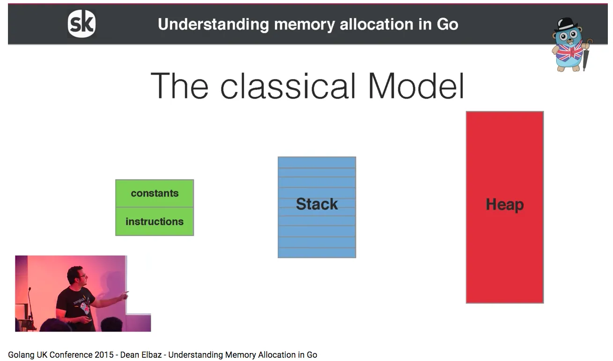
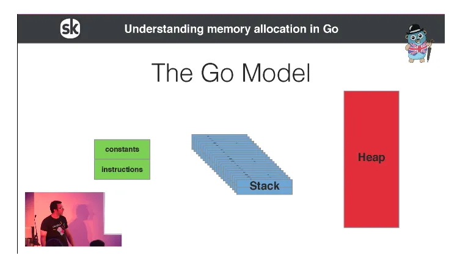
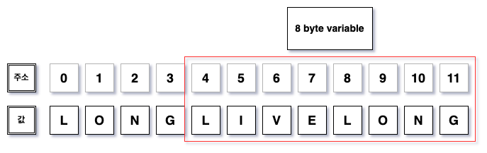
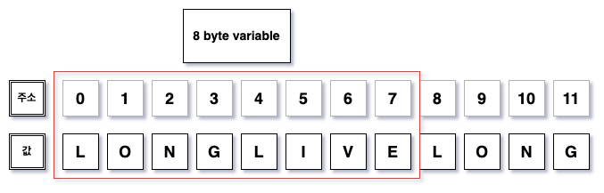
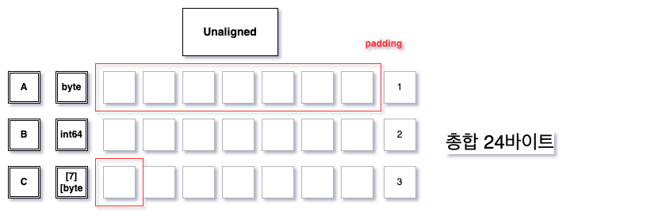
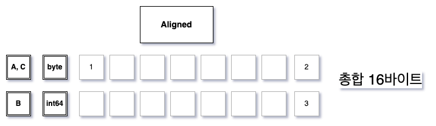

# Go 언어에서 배운 것들

## 언어 디자인의 원칙

### 일반 원칙

Go를 디자인할 때, 적어도 구글에서는 Java와 C++가 서버를 작성할 때 가장 많이 사용되는 언어였다. 우리는 이 언어는 bookkeeping(부기)와 반복이 너무 많이 필요하다고 느꼈다. 이에 대해 일부 프로그래머는 효율성과 타입 안정성을 포기하며 동적이고 유동적인 파이썬 같은 언어로 옮겨가는 식으로 대응했다. **우리는 한 언어가 효율성, 안정성, 유동성을 모두 겸비할 수 있으면 했다.**

Go는 이 모두를 위해 타이핑의 양을 줄이려고 시도한다. Go의 디자인 내내 복잡함과 불필요한 코드를 덜어내려 애썼다. forward declaration(전방 선언)을 없애려 했고 헤더 파일도 없다. 모든 것은 한 번에 선언된다. 초기화는 표현이 풍부하고 자동적이며 사용하기 쉽다. 문법은 깔끔하고 언어의 키워드가 가볍다. `(foo.Foo* myFoo = new(foo.Foo))`같은 반복은 `:=` 의 사용으로 단순하게 하려 했다. 가장 급진적으로는, 타입 위계가 없다. 그 본인일 뿐이며, 관계를 표현하지 않아도 된다. 이 단순함이 Go가 표현이 풍부하면서도 이해가 쉽고 생산성을 높일 수 있게 한다.

다른 중요한 원칙은 **개념이 직교(orthogonal)하도록 했다. 메소드는 어떤 타입을 위해서든 구현 가능하고, 구조체는 데이터를 표현하고 인터페이스는 추상성을 표현하는 등 각각은 구분되며 영향 받거나 종속되지 않는다. Orthogonality가 이 개념들이 결합할 때 무슨 일이 일어날지 예측 가능하게 한다.**

* forward declarations : 함수가 쓸 다른 함수의 선언이 반드시 사용 함수 위에 있어야 하는 것 

* 전방 선언이 없는 언어
```python
def hi():
    print("Hello babe")
    bye()

def bye():
    print("Bye, babe. Call me later")

hi()

Hello babe
Bye, babe. Call me later
```

* 전방 선언 언어: C, C++
```cpp
#include <iostream>

// forward declaration
void sayHello();  // 선언이 명시적으로 필요함

int main() {
    sayHello();
}

void sayHello() {
    std::cout << "Hello!" << std::endl;
}
```

* 기타: javascript hoisting
  - 변수(`var`)나 함수 선언이 해당 스코프의 최상단으로 끌어올려지는 현상

```javascript
foo();

// 런타임 시에 함수 정의가 최상단으로 끌어올라감
function foo() {
  console.log("I am foo");
}
```
* forward declaration과의 차이
  * forward declaration: 컴파일 시 체크, 수동 적용
  * hoisting: 런타임 시 자동으로 적용


### Go 언어에서 exception이 없는 이유

Exception을 try - catch - finally와 같은 제어 구조체(control structure)에 결합하는 건 코드를 난해하게 만든다고 믿는다. 이는 또한 프로그래머가 파일이 안 열리는 경우가 같이 흔히 발생할 수 있는 에러를 예외적이라고 규정하게 한다고 생각한다.

Go는 다른 접근법을 취한다. 일반 에러 핸들링은 Go의 multi-value을 하고, 이는 리턴값을 overload하지 않으며 에러를 report할 수 있게 한다. Go의 다른 기능과 결합된 일반적인 형태(canonical)의 error 타입이 있어 에러 핸들링을 즐겁게 하면서도 다른 언어와 다르게 한다.

Go는 동시에 프로그램에 크리티컬한 예외 상황을 signal하고 recover하는 built-in 기능도 있다. recovery 메카니즘은 함수의 상태가 에러로 무너지는 일부분으로 실행된다. 이는 재해에 가까운 예외를 다루기 충분하면서도 별도의 control structure가 필요없으며, 잘 쓰이면 깔끔한 에러 핸들링 코드를 작성하는 데 도움이 된다. 

#### 다른 언어와 차이

python 등 주요 언어와 달리 try - catch 구문이 없다. 이때의 특징 (thx. GPT)

| 특징 | Go의 에러 처리 (명시적 반환) | 예외 처리 (try/catch) |
|---|---|---|
| 에러 처리 흐름 | 명시적으로 error 반환 후, 호출자에서 처리 | 예외 발생 시 자동으로 흐름 변경 |
| 장점 | 에러가 숨겨지지 않음, 성능 효율적, 제어 흐름 명확(다른 곳으로 튀어가지 않음) | 코드 간결함, 에러 처리 코드 분리 |
| 단점 | 에러 처리 코드 반복, 에러 타입이 단순(에러 타입 시 코드가 복잡해짐. 관련 syntatic sugar가 없음), 일관성 부족 | 예외가 숨겨질 수 있음(try 블락의 어떤 코드에서 어떤 에러가 발생할지, 에러가 묻힐지 추적하기 어려울 수 있음), 성능 오버헤드(많은 언어에서 에러 핸들링을 위한 런타임 메커니즘이 내장되어 있고 비쌈. ex. stack unwinding) |
| 에러 타입 | 단순한 값 (error 인터페이스) | 예외 객체 (다양한 속성 제공) |
| 제어 흐름 | 명시적, 코드 흐름 내에서 처리 | 예외 발생 시 흐름이 자동 변경 |


#### Go의 에러에 대해

**go의 에러는 내장된 interface**

```go
type error interface {
    Error() string
}
```
error는 인터페이스 타입이며, `Error()`를 구현한 모든 것은 error가 된다. error 타입은 built-in이며, `universe block`에 `predeclared`되어 있다.

#### 에러가 단순한 값일 때 이런 어려움이 있을 수 있을까요?
```go
// 예외 구분이 까다로움
// 구체적인 에러 타입을 확인하고 싶다.
package main

import (
	"fmt"
)

type NotFoundError struct {
	Message string
}

func (e *NotFoundError) Error() string {
	return e.Message
}

func doSomething() error {
	return &NotFoundError{Message: "Resource not found"}
}

func main() {
	err := doSomething()
	if err != nil {
		if nfe, ok := err.(*NotFoundError); ok {
			// NotFoundError 타입이면
			fmt.Println("Not Found Error:", nfe.Message)
		} else {
			// 다른 타입의 에러 처리
			fmt.Println("Unknown error:", err)
		}
	}
}
```

#### 반복적인 에러 핸들링을 단순화하기~

go 언어에서 에러 핸들링은 중요하다. 언어 디자인과 컨벤션이 명시적으로 에러를 체크하도록 장려한다. 몇몇 경우 이 패턴이 Go 코드를 verbose하게 하는데, 다행히도 이를 최소화할 몇몇 기법이 있다.

```go
// 일반적인 발상. 
// if err... 로 떡칠될 수 있는 불편함이 있다.
func init() {
    http.HandleFunc("/view", viewRecord)
}

func viewRecord(w http.ResponseWriter, r *http.Request) {
    // appengine: DB에서 record를 query해 template로 포매팅
    c := appengine.NewContext(r)
    key := datastore.NewKey(c, "Record", r.FormValue("id"), 0, nil)
    record := new(Record)
    if err := datastore.Get(c, key, record); err != nil {
        http.Error(w, err.Error(), 500)
        return
    }
    if err := viewTemplate.Execute(w, record); err != nil {
        http.Error(w, err.Error(), 500)
    }
}
```

이런 식으로 error catch가 늘어날 수 있다. 이 정도는 양반으로 계속계속 늘어나며 copy paste의 지옥을 볼 수도 있다.

```go
type appError struct {
    Error   error
    Message string
    Code    int
}
type appHandler func(http.ResponseWriter, *http.Request) *appError

func viewRecord(w http.ResponseWriter, r *http.Request) *appError {
    c := appengine.NewContext(r)
    key := datastore.NewKey(c, "Record", r.FormValue("id"), 0, nil)
    record := new(Record)
    if err := datastore.Get(c, key, record); err != nil {
        return &appError{err, "Record not found", 404}
    }
    if err := viewTemplate.Execute(w, record); err != nil {
        return &appError{err, "Can't display record", 500}
    }
    return nil
}

func (fn appHandler) ServeHTTP(w http.ResponseWriter, r *http.Request) {
    if e := fn(w, r); e != nil { // e is *appError, not os.Error.
        c := appengine.NewContext(r)
        c.Errorf("%v", e.Error)
        http.Error(w, e.Message, e.Code)
    }
}


func init() {
    http.Handle("/view", appHandler(viewRecord))
}
```

### 왜 타입 상속이 없을까요?

객체 지향 프로그래밍은 적어도 패러다임 중에 가장 잘 알려져있지만 타입간 관계에 대한 너무 많은 토론이 필요하며 관계가 자동적으로 생겨나기도 한다. Go는 다른 접근을 취했다.

**두 타입이 관련 있음을 미리 선언하도록 요구하는 대신, Go에서 타입은 인터페이스의 메소드를 만족하기만 하면 된다.** 불필요한 부기를 줄일 뿐 아니라, 추가적인 장점이 더 있다. 타입은 여러 인터페이스를 동시에 만족할 수 있어 기존의 복잡한 다중 상속의 복잡함을 피할 수 있다. **인터페이스는 매우 가벼울 수 있으며, 메소드가 없거나 하나뿐인 인터페이스가 개념을 표현하는 데 유용하다. 인터페이스는 구현 이후 새 아이디어가 도출됐거나 테스트를 위해 추가될 수도 있다.** 타입과 인터페이스간 명시적인 관계가 없기 때문에 관리하거나 논쟁할 위계가 없다.

#### interface의 typing

> typing: "typing"이라고 정의된 "데이터 타입 할당"은 일련의 비트를 메모리 안의 값 또는 어떤 객체를 변수로 만드는 의미가 있다.
>
> https://en.wikipedia.org/wiki/Type_system

go에서의 인터페이스는 duck typing 방식으로 동작한다. 즉, 요구되는 메소드 집합만 구현하면 인터페이스로 인식한다.  

```go
type Animal interface {
    Bark()
}

type Pig struct {}

func (p Pig) Bark() {
    fmt.Println("꿀꿀, 꿀벌")
}

type Dog struct {}

func (d Dog) Bark() {
    fmt.Println("멍멍, 멍들었어")
}

p := Pig{}
d := Dog{}

p.Bark()
d.Bark()

꿀꿀, 꿀벌
멍멍, 멍들었어
```

그런데 보다 구체적으로 structural typing이라고도 한다.

* duck typing: "같은 행동을 하면 같은 타입으로 간주한다". **런타임 시 인터페이스 판단**
  - python, ruby, etc

```python
import random


def quack(o):
    print(o.quack())


dumb_duck = bool(random.randint(0, 2))
if dumb_duck:
    class Duck:
        pass
else:
    class Duck:
        def quack(self):
            print("I can speak!")

d = Duck()
d.quack()  # 런타임 시에 결정됩니다
```

* structural typing: "구조가 같으면 같은 타입으로 간주한다". **컴파일 시 인터페이스 판단**. 
  - go, typescript

```go
type Quacker interface {
	Quack()
}

type Duck struct{}

func (d Duck) Quack() {
	fmt.Println("Quack!")
}

func makeQuack(q Quacker) {
	q.Quack()
}

func main() {
	makeQuack(Duck{}) // 컴파일 타임에 Duck이 Quacker 인터페이스를 만족함을 확인
}
```

즉, go의 typing은 duck typing이라고 해도 되지만, 보다 구체적이고 정확한 표현은 structural typing이다!

#### duck typing의 장단점

|제목|장점|단점|
|------|---|---|
|duck typing| 자바의 nominal typing과 달리 명시적인 정의가 필요없어 코드 절약.(`implements` 키워드 등) 따라서 테스트, 프로토파이팅에 용이 | 명시적인 정의가 없어 코드가 많아질수록 의도하지 않는 인터페이스 구현이 발생할 수 있음?  |

써본 분들, 뭐가 불편하던가요??


### Go가 암묵적인 숫자 형변환을 지원하지 않는 이유

python 같은 언어는 implicit casting을 지원한다.

```python
# 4가 float로 업캐스팅
int(4) / float(2)

2.0
```

그러나 go는 그렇지 않다.

```go
a := 4.0
b := 2
a/b

invalid operation: a / b (mismatched types float64 and int)
```

C의 숫자간 자동 형변환의 이점보다 이로 인해 발생하는 혼란이 더 크다. unassigned인지 어떻게 알지? 오버플로가 발생하나? 결과값이 아키텍쳐에 독립적인가, 이식 가능한가(portable)... 또한 이는 컴파일러 개발을 어렵게 하며, 아키텍쳐마다 일관되지 않는다. 

**코드의 이식성을 보장하기 위해** 몇몇 상황에서 명확한 형변환일지라도 반드시 일관되게 형 변환을 강제했다. 물론 Go의 상수가 이 문제를 좀 개선하기는 한다.

### maps, slices, channel은 reference인데 array는 왜 Values죠?

긴 이야기가 있지... 개발 당시 maps, channel는 문법적으로 pointer로 계획되었고 비 포인터 객체를 선언하고 쓸 수 없었어. array도 많이 고민했는데. 결국 우리는 pointer, values의 엄격한 분리가 언어를 사용하기 어렵게 만든다고 생각했어. 이 타입을 연결된 공유된 자료구조에 대한 referecene(descriptor)로서 동작하게 해서 이 이슈를 풀었어. 물론 이 변화가 언어의 슬픈 복잡함을 추가했지만, 사용성과 생산성은 크게 향상되었다고 생각해. 

* pointer: 변수의 메모리 주소를 담는 변수
* reference: 맵, 채널, 슬라이드, 포인터. 메모리 주소를 참조하는 descriptor (메타데이터). 포인터처럼 `&`, `*`를 쓰지 않아도 된다.
  - 그외에는 전부 value types이다.

```go
// value types

// int
a := 3
b := a
b = 100
fmt.Println(a)
// 3

// array
xx := [5]int{1, 2, 3, 4, 5}
xy := xx
xy[3] = 100
fmt.Println(xx)
// [1 2 3 4 5]
```

```go
// reference types

nameScore := map[string]int{"apple": 3}
nameScoreChild := nameScore
nameScoreChild["apple"] = 100
fmt.Println(nameScore)
// map[apple:100]

i := 3
var p *int = &3
p2 := p
*p2 = 4
fmt.Println(*p)
// 4

x := make(chan int)
y := x
go func() {
    y <- 2
}()
fmt.Println(<-x)
// 2

xx := []int{1, 2, 3, 4, 5}
xy := xx
xy[3] = 100
fmt.Println(xx)
// [1 2 3 100 5]
```

* map, slice, channel, pointer는 reference type으로 함수의 인자로 넣거나 대입 시 자신에 대한 reference를 반환 (내부적으로는 pointer를 사용한다고 함)
  - go에서는 dereference 시 `*` deference operator를 필요하지 않다 -> syntatic sugar 지원


#### golang의 runtime 메모리 관리

POSIX의 프로세스 메모리 자료구조는 일반적으로 다음과 같다:


* 상수, 코드: 코드 및 상수, static 값 저장 공간. 보통 작고 컴파일 시 결정
* heap: 런타임 시에 크기가 유동적으로 조절되고, 포인터, 배열 및 그외 자료구조 저장 공간. 메모리 소모량이 큰 값은 heap에서 관리
* stack: stack frame으로 구성되며 함수가 호출될 때마다 stack에 push됨. 함수가 종료할 때 stack pop
  - **스택이 하나임은 오직 하나의 실행 상태만을 가정하고 있음. 이는 멀티스레딩에는 적합하지 않음 -> 각 스레드에 로컬 변수가 많을 수 있다. 다시 말해 기술적으로 스레드의 개수가 제한될 수 있다.**

이때 기존 프로세스 모델은 stack이 8MB 정도로 작음. 이는 멀티스레드나 재귀 등을 통해 함수를 매우 많이 실행해야 할 때 stack overlfow가 발생할 수 있음. 즉, stack size도 동적이어야 한다. 

golang의 언어적 메모리 모델



* **goroutine 하나마다 하나의 스택**
* heap에서 메모리를 대여하여 stack의 크기를 동적으로 변경할 수 있음. 이를 통해 수만개의 goroutine을 실행 가능케한다.
* 물론 이는 POSIX 프로세스 메모리 구조 위에서 동작하는 언어 차원의 메모리 동작 구조(like JVM)


### 참고
* https://go.dev/doc/faq#principles
* https://go.dev/blog/error-handling-and-go
* https://medium.com/@edwardpie/understanding-the-memory-model-of-golang-part-2-972fe74372ba


---

## 메모리 정렬

### 메모리 정렬이란

Memory alignment는 CPU 레지스터가 데이터를 효율적으로 읽고 쓸 수 있도록 데이터를 메모리에서 정렬하는 방식.  
현대 CPU의 레지스터는 64bit 체제로, 메모리 접근 시 메모리 버스를 이용. 이때 64비트 단위로 전송하며, 메모리 주소를 0, 8, 16등 8의 배수일 때 최대 효율로 데이터를 읽을 수 있음.

따라서 많은 언어에서 값을 담는 변수의 메모리 주소를 8의 배수로 배치.



예를 들면, 변수의 주소를 표현할 때 8의 배수로 표현하면 CPU 레지스터는 한 번만 주소를 읽으면 됨. 그러나 8의 배수가 아닐 때는 두 번의 걸쳐 나눠 읽고 결합해야 함

> READ(0 - 7) + READ(8 - 15)



반면 메모리 주소가 8바이트 단위로 최적화되어 있을 때 메모리 접근을 1번으로 최소화할 수 있음

> READ(0 - 7)

### Go 언어에서의 메모리 정렬

Go struct에서는 필드 순서에 따라 메모리 효율성이 달라진다.

```go
package main

import (
    "fmt"
    "unsafe"
)

type Unaligned struct {
    A byte
    B int64
    C [7]byte
}

func main() {
    a := Unaligned{1, 2, 3}

    fmt.Printf("Size of a is %d", unsafe.Sizeof(a))
}

Size of a is 24
```



* 필드 순서에 따라 메모리 패딩이 붙어 공간 낭비


```go
type Aligned struct {
    A byte
    C [7]byte
    B int64
}

func main() {
    a := Aligned{1, 2, 3}
    fmt.Printf("Size of b is %d", unsafe.Sizeof(b))
}

Size of a is 16
```



* 패딩이 필요하지 않아 메모리 효율화 극대


struct 메모리 정렬은 다음의 경우에 유리할 수 있음
* 임베디드 프로그래밍
* memory intensive job
  * cloud의 경우, 메모리를 절약할 수 있는 더 저렴한 머신을 사용할 수 있음


**Go 언어에서의 struct 메모리 정렬을 위한 일반적인 good practice는 크기가 작은 필드를 앞에 두자**


## [Share Memory By Communicating](https://go.dev/doc/codewalk/sharemem/)

### 일반적인 언어의 동시성 처리 (Communicate by sharing memory)

```go
package main

import (
    "fmt"
    "sync"
    "time"
)

type Queue struct {
    data []int
    lock sync.Mutex
}

func (q *Queue) Enqueue(item int) {
    q.lock.Lock()
    defer q.lock.Unlock()
    q.data = append(q.data, item)
    fmt.Printf("Produced: %d\n", item)
}

func (q *Queue) Dequeue() int {
    q.lock.Lock()
    defer q.lock.Unlock()
    if len(q.data) == 0 {
        return -1 // Queue is empty
    }
    item := q.data[0]
    q.data = q.data[1:]
    fmt.Printf("Consumed: %d\n", item)
    return item
}

func main() {
    queue := &Queue{}

    // Producer
    go func() {
        for i := 0; i < 10; i++ {
            queue.Enqueue(i)
            time.Sleep(500 * time.Millisecond) // Simulate production delay
        }
    }()

    // Consumer
    go func() {
        for {
            item := queue.Dequeue()
            if item != -1 {
                time.Sleep(1 * time.Second) // Simulate consumption delay
            }
        }
    }()
}
```

쓰레드(goroutine)간 직접적인 데이터(data) 공유를 통해 소통한다.  
이 방식은 다음과 같은 특징이 있다.

* **공유 메모리에 직접 접근**
* 동기화 로직을 명시적으로 관리해야 하며 Error-prone
* race condition 위험


### Go의 선호되는 동시성 처리 (Share memory by communcating)


```go
package main

import (
    "fmt"
    "time"
)

func producer(ch chan int) {
    for i := 0; i < 10; i++ {
        ch <- i
        fmt.Printf("Produced: %d\n", i)
        time.Sleep(500 * time.Millisecond) // Simulate production delay
    }
    close(ch)
}

func consumer(ch chan int) {
    for item := range ch {
        fmt.Printf("Consumed: %d\n", item)
        time.Sleep(1 * time.Second) // Simulate consumption delay
    }
}

func main() {
    ch := make(chan int, 5)

    // Start producer and consumer
    go producer(ch)
    go consumer(ch)

    // Prevent the main function from exiting immediately
    select {}
}
```

* 직접적인 데이터가 아니라 채널을 통해 데이터 전달
* 채널이 동기화를 처리
* race condition 위험 최소화


### docs 

동시성과 멀티 스레드는 어려움으로 악명이 높았다. 이는 부분적으로 pthread의 복잡한 디자인과 뮤텍스, 조건 변수, 메모리 장벽에 대한 지나친 강조 때문이라고 생각한다. 고수준 인터페이스는 저수준에 뮤텍스 등을 두면서도 훨씬 단순한 코드를 가능케 한다.

동시성에 대한 고수준의 언어적 지원의 가장 성공적 모델은 Tonny Hoare의 Communicating Sequential Process 또는 CSP이다. CSP는 병행성 상호작용에 대한 수학적 접근에서 시작했으며 **채널을 통한 메시지 전달을 기본으로 한다.** Occam, Erlang은 이를 구현한 잘 알려진 언어이다. Go의 동시성 primitive는 CSP 계보에서 channel을 일급 객체로 둔 강력한 발상에 기반한다. 이전 언어에 대한 경험은 CSP 모델이 절차적 언어 프레임워크에 잘 맞음을 증명한다.

* 복잡한 문법을 배제하고 간결하고 명확한 코드를 작성하는 Go 철학에 부합

### 결론

* Communicate by sharing memory: `share memory`가 사용자의 책임
* Share memory by communicating: `Communication`이 사용자의 책임
  * 동시성 제공은 언어에서 책임질게!

### 참고
* https://go.dev/doc/faq#csp
* https://stackoverflow.com/questions/36391421/explain-dont-communicate-by-sharing-memory-share-memory-by-communicating
* https://go.dev/doc/codewalk/sharemem/
* https://en.wikipedia.org/wiki/Communicating_sequential_processes#cite_note-hoare1978-7