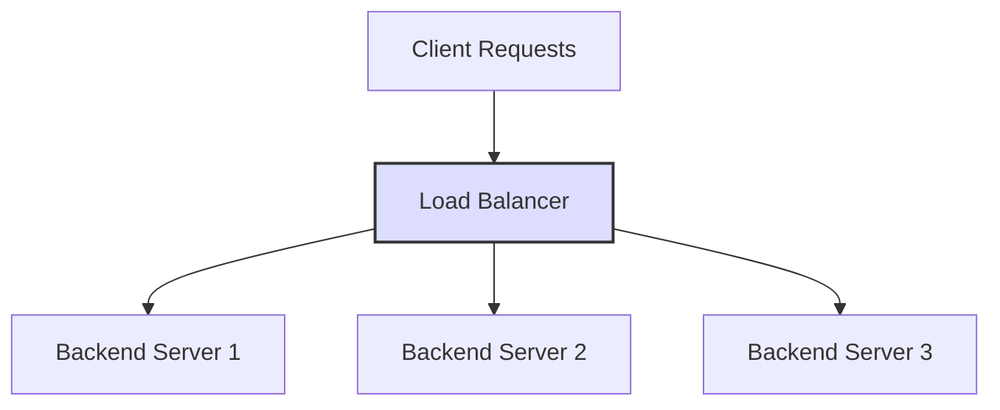

# Go로 로드 밸런서를 만들어보자
> 근데 Traefik을 곁들인.

# 로드 밸런서와 리버스 프록시
## 로드 밸런서
로드 밸런서(Load Balancer)는 여러 대의 서버 간에 클라이언트 요청을 고르게 분산하는 역할을 한다. 트래픽 과부하를 방지하고 가용성, 성능을 향상시킨다.



### 목적
- 부하 분산
- 고가용성 (장애시 대체 서버로 우회)

## 리버스 프록시
리버스 프록시(Reverse Proxy)는 클라이언트가 직접 백엔드와 통신하지 않고 중간의 프록시 서버가 요청을 대신 받아서 적절한 백엔드 서버로 전달하고 응답을 반환하는 구조다.

### 목적
- 요청 라우팅 (URL, 헤더 기반으로 특정 요청을 특정 서버로 라우팅)
- TLS 지원
- 보안 강화 (백엔드를 외부로부터 은닉)
- 캐싱, 압축, 인증 필터링 등 부가 기능

## 비교
| 항목     | 로드 밸런서                    | 리버스 프록시                          |
| ------ | ------------------------- | -------------------------------- |
| 주요 목적  | 트래픽을 여러 서버로 **분산**        | 요청을 적절한 서버로 **중계** 및 **처리**      |
| 트래픽 분산 | 핵심 기능                     | 보조 기능 (지원 가능)                    |
| 부가기능   | 로드 밸런싱 중심                 | 인증, 캐싱, 압축, TLS 종료, URL 기반 라우팅 등 |
| 예시 도구  | Traefik, HAProxy, AWS ALB | Traefik, Nginx, Apache, Envoy 등  |

# Traefik과 Nginx
## Traefik
Go로 구현된 Load Balancer이자 Reverse Proxy.

Let's Encrypt 연동으로 자동 TLS를 발급하거나 클라우드 네이티브 서비스 디스커버리를 지원한다.

2025년 6월 현재 55.2k Github star 수를 자랑한다.

[Traefik repository](https://github.com/traefik/traefik)

### 자동화된 서비스 디스커버리
Kubernetes, Docker Swarm 등 다양한 백엔드와 연동되어 서비스 인스턴스를 감지하고 라우팅 구성을 생성한다. 서비스가 배포되면 자동으로 라우팅이 반영된다.

Nginx의 경우 수동 설정이 필요하다.

### Let's Encrypt 기반 HTTPS 자동 구성
SSL 인증서를 자동으로 생성하고 갱신해줘서 쉽게 HTTPS로 제공 가능하다.

Nginx의 경우 수동 설정이 필요하다.

### 대시보드
웹 UI로 라우팅, 백엔드, TLS 상태를 실시간 확인할 수 있다.

### 미들웨어
- Rate Limiting
- Basic/Auth
- Redirect, Rewrite, StripPrefix
- CORS 설정

## Nginx
일반적으로 많이 사용되는 Reverse Proxy. 요청을 받아 적절한 백엔드로 전달하는 기능을 수행한다. 백엔드에 대한 health check를 통한 트래픽 라우팅을 지원하진 않기 때문에 로드 밸런서라기 보다는 Reverse Proxy다.

Nginx Plus(상용 제품)를 사용할 경우 health check에 기반한 장애감지와 트래픽 라우팅을 제공하기 때문에 로드 밸런서 역할도 할 수는 있다. 단, Nginx Plus는 판매되는 제품이고 오픈소스가 아니다.

## Traefik과 Nginx의 로드 밸런싱 방법

### Traefik
- WRR(Weighted Round Robin): 가중치를 고려한 라운드 로빈
- P2C(Power of two choices): 임의의 두 개 인스턴스를 선택하고 그 중 더 적은 부하를 가진 인스턴스를 선택하는 알고리즘.

### Nginx
- RR(Round Robin)
- Least Connection
- IP Hash
- Generic Hash: 특정 키(hash key) 기반 라우팅

다만 오픈소스인 Nginx는 부하 분산 기능은 제공하지만 장애 감지를 바탕으로 라우팅을 제공하지는 않는다.


# Go로 로드 밸런서를 만들어보기
Go언어로 로드 밸런서를 만들어보자. 간단한 Round Robin 예제를 확인한 후, Traefik에서 영감을 받아 자체적인 로드 밸런서를 만들어볼 예정이다.

## 라운드 로빈 기반의 간단한 로드밸런서

먼저 로드 밸런서를 가장 간단하게, Go로 구현해본다.
아래 예제는 라운드 로빈 방식으로 등록된 백엔드 서버에 돌아가며 요청을 전달하는 로드 밸런서다.

```go
package main

import (
	"log"
	"net/http"
	"net/http/httputil"
	"net/url"
	"sync/atomic"
)

var backends = []string{
	"http://localhost:8081",
	"http://localhost:8082",
	"http://localhost:8083",
}

var current uint64 // atomic counter

func getNextBackend() string {
	idx := atomic.AddUint64(&current, 1)
	return backends[int(idx)%len(backends)]
}

func handleProxy(w http.ResponseWriter, r *http.Request) {
	targetURL := getNextBackend()
	backendURL, err := url.Parse(targetURL)
	if err != nil {
		http.Error(w, "Bad backend URL", http.StatusInternalServerError)
		return
	}

	proxy := httputil.NewSingleHostReverseProxy(backendURL)
	proxy.ErrorHandler = func(w http.ResponseWriter, r *http.Request, e error) {
		http.Error(w, "Backend unavailable", http.StatusBadGateway)
	}
	proxy.ServeHTTP(w, r)
}

func main() {
	log.Println("Load balancer started on :8080")
	http.HandleFunc("/", handleProxy)
	log.Fatal(http.ListenAndServe(":8080", nil))
}
```

리팩토링을 조금 해보자.
Backend와 LoadBalancer를 분리해 별도의 구조체로 만든다.

```go
package backend

import (
	"net/http"
	"net/http/httputil"
	"net/url"
)

type Backend struct {
	http.Handler
}

// New creates a new backend server that acts as a reverse proxy to the specified server URL.
func New(serverURL string) (backend.Backend, error) {
	u, err := url.Parse(serverURL)
	if err != nil {
		return nil, err
	}

	return &Backend{
		Handler: httputil.NewSingleHostReverseProxy(u),
	}, nil
}

func (b *Backend) ServeHTTP(w http.ResponseWriter, r *http.Request) {
	b.Handler.ServeHTTP(w, r)
}

```

다음은 로드밸런서다.

```go
package lb

import (
	"fmt"
	"net/http"
	"sync/atomic"
)

type LoadBalancer interface {
	ServeHTTP(w http.ResponseWriter, r *http.Request)
	AddServer(svr backend.Backend) error
}

type loadBalancer struct {
	servers []backend.Backend
	current uint64
}

// New creates a new LoadBalancer instance.
func New() LoadBalancer {
	return &loadBalancer{
		servers: make([]backend.Backend, 0),
		current: 0,
	}
}

// Round robin으로 다음 서버를 가져옴
func (lb *loadBalancer) nextServer() http.Handler {
	if len(lb.servers) == 0 {
		return nil
	}
	idx := atomic.AddUint64(&lb.current, 1)
	return lb.servers[int(idx)%len(lb.servers)]
}

func (lb *loadBalancer) ServeHTTP(w http.ResponseWriter, r *http.Request) {
	svr := lb.nextServer()
	if svr == nil {
		http.Error(w, "No backend available", http.StatusServiceUnavailable)
		return
	}

	svr.ServeHTTP(w, r)
}

func (lb *loadBalancer) AddServer(svr backend.Backend) error {
	if svr == nil {
		return fmt.Errorf("server cannot be nil")
	}
	lb.servers = append(lb.servers, svr)

	return nil
}
```

마지막은 main이다.

```go
package main

import (
	"log"
	"net/http"

	"github.com/chaewonkong/loadigo/backend"
	"github.com/chaewonkong/loadigo/lb"
)

var backends = []string{
	"http://localhost:8081",
	"http://localhost:8082",
	"http://localhost:8083",
}

func main() {
	balancer := lb.New()

	// 리스트를 순회하며 서버 추가
	for _, u := range backends {
		b, err := backend.New(u)
		if err != nil {
			log.Fatalf("Failed to create backend for %s: %v", u, err)
		}
		err = balancer.AddServer(b)
		if err != nil {
			log.Fatalf("Failed to add backend %s: %v", u, err)
		}
	}

	if err := http.ListenAndServe(":8080", balancer); err != nil {
		log.Fatalf("Failed to start server: %v", err)
	}
}
```

LoadBalancer 안에서 서버의 offset을 관리하며, 요청시마다 다음 서버를 찾아준다.

## Health Check

지금 로드밸런서를 개선해 등록된 서버들의 status check를 하도록 해보자. Health check에 실패한 서버는 로드밸런서에서 제거해서 요청을 전달하지 않게 한다.

```go
package lb

import (
	"fmt"
	"log"
	"net/http"
	"sync"
	"sync/atomic"
	"time"

	"github.com/chaewonkong/loadigo/backend"
)

// LoadBalancer defines the interface for a load balancer that can distribute requests
type LoadBalancer interface {
	ServeHTTP(w http.ResponseWriter, r *http.Request)
	AddServer(name string, svr backend.Backend) error
	CheckServerStatus()
}

type loadBalancer struct {
	servers []backend.Backend
	status  map[string]struct{}
	current uint64
	ticker  *time.Ticker
	mu      sync.RWMutex
}

// New creates a new LoadBalancer instance.
func New(ticker *time.Ticker) LoadBalancer {
	return &loadBalancer{
		servers: make([]backend.Backend, 0),
		current: 0,
		status:  make(map[string]struct{}),
		ticker:  ticker,
		mu:      sync.RWMutex{},
	}
}

func (lb *loadBalancer) nextServer() http.Handler {
	if len(lb.servers) == 0 {
		return nil
	}

	for i := 0; i < len(lb.servers); i++ {
		idx := atomic.AddUint64(&lb.current, 1)
		svr := lb.servers[int(idx)%len(lb.servers)]
		lb.mu.RLock()
		_, ok := lb.status[svr.Name()]
		lb.mu.RUnlock()
		if ok {
			return svr
		}
	}

	return nil
}

func (lb *loadBalancer) ServeHTTP(w http.ResponseWriter, r *http.Request) {
	svr := lb.nextServer()
	if svr == nil {
		http.Error(w, "No backend available", http.StatusServiceUnavailable)
		return
	}

	svr.ServeHTTP(w, r)
}

func (lb *loadBalancer) AddServer(name string, svr backend.Backend) error {
	if svr == nil {
		return fmt.Errorf("server cannot be nil")
	}

	lb.mu.Lock()
	defer lb.mu.Unlock()
	lb.status[name] = struct{}{}

	lb.servers = append(lb.servers, svr)
	return nil
}

func (lb *loadBalancer) CheckServerStatus() {
	for range lb.ticker.C {
		for name := range lb.status {
			alive := lb.checkServerStatus(name)
			if alive {
				lb.mu.Lock()
				lb.status[name] = struct{}{}
				lb.mu.Unlock()
			} else {
				lb.mu.Lock()
				delete(lb.status, name)
				lb.mu.Unlock()
				log.Printf("Server %s is down, removing from status", name)
			}
		}
	}
}

func (lb *loadBalancer) checkServerStatus(url string) bool {
	resp, err := http.Get(url)
	if err != nil {
		return false
	}
	defer resp.Body.Close()

	return resp.StatusCode == http.StatusOK
}

```

`CheckServerStatus()` 메서드를 만들었다.

다음은 Backend 코드다.

```go
type Backend interface {
	ServeHTTP(w http.ResponseWriter, r *http.Request)
	Name() string
}
```

`Name()` 메서드를 추가했고, URL을 반환한다.

main.go는 goroutine이 추가되었다.

```go
func main() {
	ticker := time.NewTicker(5 * time.Second)
	balancer := lb.New(ticker)
	for _, u := range backends {
		b, err := rr.New(u)
		if err != nil {
			log.Fatalf("Failed to create backend for %s: %v", u, err)
		}
		err = balancer.AddServer(u, b)
		if err != nil {
			log.Fatalf("Failed to add backend %s: %v", u, err)
		}
	}

	go balancer.CheckServerStatus() // <= 이 부분이 추가됨

	if err := http.ListenAndServe(":8080", balancer); err != nil {
		log.Fatalf("Failed to start server: %v", err)
	}
}
```


## Weighted Round Robin 기반의 로드밸런서

각 서버에 가중치를 부여하고, 가중치 비율에 따라 더 많은 요청을 받도록 하는 Round Robin의 변형 알고리즘이다.

Traefik의 default strategy로 이용된다.

Traefik의 경우 EDF(Earliest Deadline First)에 기반한 Weighted Round Robin 로드 밸런서를 제공하는데, 데드라인이 짧게 남은 server에서 request를 처리하게 되며, deadline을 계산할 때는 가중치를 고려해 계산 및 저장한다.

1. 각 서버는 deadline 값을 가지고 로드밸런서에 등록된다. 서버가 등록될 때, deadline은 현재 로드밸런서의 currentDeadline에 `1/weight`를 더한 값으로 설정된다.
2. 로드밸런서는 매 요청마다 가장 deadline이 가까운 서버를 선택해 처리를 위임한다.
3. 선택된 서버는 deadline에 `1/weight`를 더한 값을 새 deadline으로 가지고 다음 라운드에 다시 참여한다.

여기서 curDeadline은 현재까지 진행된 시간을 상징하는 가상의 시간이다. (스케줄 기준점)

### backend

weight와 deadline이 추가되었다. deadline은 내부적으로 다음 서버를 고를 때 사용되며, weight는 각 서버별로 주어지는 0에서 1 사이의 가중치다.
```go
type Backend struct {
	http.Handler
	name string

	weight   float64
	deadline float64
}
```

### lb
mean Heap으로 만들어서 deadline이 작은 서버(백엔드)부터 반환할 수 있게 한다.
```go
func (lb *loadBalancer) Len() int {
	return len(lb.servers)
}

func (lb *loadBalancer) Less(i, j int) bool {
	return lb.servers[i].deadline < lb.servers[j].deadline
}

func (lb *loadBalancer) Swap(i, j int) {
	lb.servers[i], lb.servers[j] = lb.servers[j], lb.servers[i]
}

func (lb *loadBalancer) Push(x interface{}) {
	b, ok := x.(*Backend)
	if !ok {
		return
	}

	lb.servers = append(lb.servers, b)
}

func (lb *loadBalancer) Pop() interface{} {
	if len(lb.servers) == 0 {
		return nil
	}

	b := lb.servers[len(lb.servers)-1]
	lb.servers = lb.servers[:len(lb.servers)-1]

	return b
}
```


다음으로 lb에 backend를 추가하는 AddServer를 살펴보자.
```go
func (lb *loadBalancer) AddServer(name string, svr backend.Backend) error {
	if svr == nil {
		return fmt.Errorf("server cannot be nil")
	}

	b, ok := svr.(*Backend)
	if !ok {
		return fmt.Errorf("server must be of type *Backend")
	}

	lb.mu.Lock()
	defer lb.mu.Unlock()

	// set initial deadline for the server
	b.deadline = lb.curDeadline + 1/(b.weight)
	heap.Push(lb, b)

	lb.status[name] = struct{}{}

	lb.servers = append(lb.servers, b)
	return nil
}
```

lb에 지정된 curDeadline에 `1/backend.wieght`를 더하고 있다.  

curDeadline은 lb가 가장 최근에 라우팅한 서버의 deadline을 가지고 있는데, 이 값을 더해 새로 추가하는 서버의 deadline을 계산함으로써, 새로 추가된 서버가 무조건 제일 먼저 선택되지 않고 가중치에 따라 선택되게 한다.

만약 curDeadline이 0일 떄,
weight가 0.5이면 deadline은 2가 된다.
weight가 0.25이면 deadline은 4가 된다. 

mean Heap 특성상 작은 값부터 먼저 pop() 되기 때문에 결과적으로 weight가 클수록 먼저 선택받게 된다.

마지막으로 `nextServer()`는 아래와 같다.
```go
func (lb *loadBalancer) nextServer() http.Handler {
	if len(lb.servers) == 0 {
		return nil
	}

	lb.mu.Lock()
	defer lb.mu.Unlock()

	var b *Backend
	for {
		b = heap.Pop(lb).(*Backend)

		lb.curDeadline = b.deadline
		b.deadline += 1 / (b.weight)
		heap.Push(lb, b)

		if _, ok := lb.status[b.Name()]; ok {
			break
		}
	}

	return b
}
```

status가 healthy한 서버들 중 deadline이 작은 서버 순으로 반환된다. 

루프를 돌 때마다 lb의 curDeadline에 `backend.deadline`을 대입하고, `1/backend.Weight` 만큼을 추가한다.

curDeadine을 heap.Pop()으로 가져온 backend의 deadline으로 바꿔주는 이유는 선택된 서버의 deadline을 기준으로 이후 새로 추가되는 서버의 deadline을 갱신하기 위함이다.

이는 새로 추가되는 서버가 공정하게 경쟁할 수 있게 하기 위해 curDeadline이 사용되는 것이다.


### 정리
weight가 0.2, 0.3, 0.5인 서버가 3개 있고 1000개의 요청이 들어온다면 아래와 유사하게 동작하게 된다.

| 서버 | 요청 수 (예상) |
| -- | --------- |
| A  | 200       |
| B  | 300       |
| C  | 500       |


## P2C 알고리즘 기반의 로드밸런서

feat. Traefik

### P2C(Power of Two Choices)

임의의 2개 서버를 랜덤으로 고른 후, 2개 서버 중 실시간 연결 수가 더 적은 서버를 연결하게 하는 알고리즘.

간단하게 구현할 수 있음에도 효과적인 알고리즘이며, Traefik에서도 제공한다.

| 전략                | 최대 부하 분산 수준    | n = 1000일 때, |
| ------------------- | ---------------------- | -------------- |
| 무작위(random) 선택 | `O(log n / log log n)` | 3.58           |
| **P2C**             | `O(log log n)`         | 1.93           |

무작위로 분산하는 경우 한 서버가 3.6배 가까이 더 많은 요청을 처리해야만 한다. P2C는 이에 비해 절반 수준의 부하로 유지된다.

### backend
backend가 처리 중인 요청수를 확인할 수 있게 아래처럼 코드를 inflight를 추가한다.
```go
type Backend struct {
	http.Handler
	name string

	// inflight tracks the number of inflight requests to this backend.
	inflight atomic.Int64
}

func (b *Backend) ServeHTTP(w http.ResponseWriter, r *http.Request) {
	// Increment the inflight counter when a request is received.
	// Decrement it when the request is done.
	b.inflight.Add(1)
	defer b.inflight.Add(-1)

	b.Handler.ServeHTTP(w, r)
}

func (b *Backend) Inflight() int64 {
	return b.inflight.Load()
}

```

### lb
다음으로 로드 밸런서 로직을 수정해 본다.

```go
type loadBalancer struct {
	servers   []*Backend
	status    map[string]struct{}
	current   uint64
	ticker    *time.Ticker
	backendMu sync.RWMutex
	randMu    sync.Mutex

	randInt func(n int) int
}

func NewLoadBalancer(ticker *time.Ticker) LoadBalancer {
	return &loadBalancer{
		servers:   make([]*Backend, 0),
		current:   0,
		status:    make(map[string]struct{}),
		ticker:    ticker,
		backendMu: sync.RWMutex{},
		randMu:    sync.Mutex{},
		randInt:   rand.New(rand.NewSource(time.Now().UnixNano())).Intn,
	}
}
```

Random하게 2개의 server를 뽑고 그 중 inflight가 적은 server로 라우팅 할 것이기 때문에 randInt라는 함수를 만들어줬다.

`Rand.Intn` 은 0과 n-1 사이의 random int를 반환하는 메서드다.

다음으로 `nextServer()` 메서드를 살펴보자.

먼저 healthy한 서버만 추려낸 후, random으로 i, j int를 선정한다.
만약 `i == j`인 상황이라면 j에 1을 더하고, healthy의 길이로 나머지 연산을 해준다.
```go
func (lb *loadBalancer) nextServer() http.Handler {
	if len(lb.servers) == 0 {
		return nil
	}

	healthy := []*Backend{}
	lb.backendMu.RLock()
	for _, b := range lb.servers {
		if _, ok := lb.status[b.Name()]; ok {
			healthy = append(healthy, b)
		}
	}
	lb.backendMu.RUnlock()
	if len(healthy) == 0 {
		return nil
	}

	if len(healthy) == 1 {
		return healthy[0]
	}

	// p2c
	lb.randMu.Lock()
	// randInt returns a random integer between 0 and n-1
	i, j := lb.randInt(len(healthy)), lb.randInt(len(healthy))
	lb.randMu.Unlock()

	// Ensure b1 and b2 are different
	if i == j {
		i = (j + 1) % len(healthy)
	}

	b1, b2 := healthy[i], healthy[j]

	// check load (inflight requests) and return backend with fewer inflight requests
	if b1.Inflight() < b2.Inflight() {
		return b1
	}

	return b2
}
```

마지막으로 Inflight이 작은 백엔드(서버)를 반환하면 종료된다.

아래는 AddServer 로직이다. 큰 차이는 없고, `*Backend` 타입인지 체크하는 로직만 편의상 추가했다.
(향후 리팩토링에서는 type assertion을 들어내는 게 좋을 것 같다)

```go
func (lb *loadBalancer) AddServer(name string, svr backend.Backend) error {
	if svr == nil {
		return fmt.Errorf("server cannot be nil")
	}

	backend, ok := svr.(*Backend)
	if !ok {
		return fmt.Errorf("server must be of type *p2c.Backend")
	}

	lb.backendMu.Lock()
	defer lb.backendMu.Unlock()
	lb.status[name] = struct{}{}

	lb.servers = append(lb.servers, backend)
	return nil
}
```


# 더 발전할만한 부분
Traefik의 경우 클라우드 네이티브 환경에서 서비스 디스커버리를 지원한다.  Pod, Service, Endpoint를 감지하고 자동으로 라우팅을 생성한다.

오토 스케일링, 롤링 업데이트 등으로 인프라가 자주 변경되는 경우 사람이 수동으로 라우팅 설정을 갱신하기 어렵다.

Traefik을 사용하면 IP, Port가 바뀌어도 자동으로 인식하고 반영할 수 있어서 Kubernetes 환경에 최적이다.

현재 우리가 만든 로드 밸런서의 경우, 서비스 디스커버리 기능이 없고, 따라서 백엔드의 IP와 포트 정보를 수동으로 구성해줘야만 한다.

Traefik은 Kubernetes API Server와 통신하여 리소스들을 실시간으로 관찰하는 데, 이런 부분은 추가로 반영해볼만 할 것 같다.

## 참고자료

- [Creating a Load Balancer in GO](https://medium.com/@leonardo5621_66451/building-a-load-balancer-in-go-1c68131dc0ef)
- [Golang Load Balancer](https://github.com/leonardo5621/golang-load-balancer)
- [Traefik Docs](https://doc.traefik.io/traefik/)
- [Traefik P2C 구현 코드](https://github.com/traefik/traefik/blob/master/pkg/server/service/loadbalancer/p2c/p2c.go)
