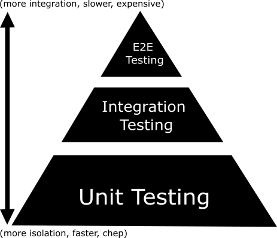

# Go based test

# 🧪 Go로 테스트를 써본 이야기: "테스트, 나도 잘 몰라요"

## 1. 🙋 Intro - 테스트? 사실 나도 잘 몰라요

- "테스트 코드는 중요하다"라는 말은 익히 들었지만
→ **무엇을 테스트해야 할지**, **어떻게 시작해야 할지**는 막막했음
- 그래서 시작한 **실전 위주의 테스트 경험 공유**
- 이 자료는 **완벽한 테스트 이론이 아닌**, **"나도 이렇게 하면서 경험했다"**에 가깝습니다.

## 📖 보통 책에서 이야기하는 것들 vs 내가 느낀 것들

> "유닛 테스트, 어디까지 고민하고 써야 할까?"
> 

### 🧠 책에서 이야기하는 테스트 스타일들

- 유닛 테스트 관련 책들(예: [Unit Testing](https://product.kyobobook.co.kr/detail/S000001805070))에서는 보통 두 가지 테스트 스타일을 다룹니다:

| 스타일 | 설명 |
| --- | --- |
| **고전파(Classical/Chicago School)** | 진짜 객체와 실제 흐름을 테스트 (side effect 허용) |
| **런던파(London School)** | 모든 의존성은 mock, 테스트는 행동(Behavior)을 검증 |
- 흔히 TDD 논쟁에서 나오는 스타일 차이기도 함
- Go 커뮤니티에서도 일부는 고전파, 일부는 런던파의 접근을 차용하는 것으로 알고 있음

---

### 🙋‍♂️ 나는 이런 분류를 신경쓰지 않습니다

- 나는 “고전파냐 런던파냐”를 정하고 테스트하지 않음
- AAA 패턴(준비, 실행, 검증), Given-When-Then 패턴을 정하고 테스트하지 않음
- 그런 스타일 구분보다 더 중요한 건 **실제로 도움이 되냐**는 것

---

## 🧩 그럼 나는 언제 테스트를 쓰는가?

> "내가 테스트가 필요하다고 느끼는 순간은 딱 이럴 때다"
> 

### 🔄 테스트가 필요한 코드의 기준 (개인 기준)

| 조건 | 이유 |
| --- | --- |
| **코드가 더럽거나 설명이 부족한 경우** | 테스트가 설명서 역할을 해주기 때문 |
| 과거에 이 코드가 문제를 일으킨 적이 있을 때 | 회귀 방지를 위해 (잘못된 코드 검출을 위해) |
| 다른 사람이 이해하기 어려운 복잡한 코드 | 로직이 분기 많고 한눈에 안 들어올 때 |

→ 특히, **"코드만 봐서는 이게 왜 이렇게 동작하는지 이해 안 될 때"**, 테스트는 설명서 그 자체가 된다.

사실, 타겟 함수를 실행해볼 수 있다는 것 자체로도 유익한 것 같다.  
꼭 견고한 테스트 코드가 아니더라도, 아래와 같이 해당 함수만 실행 및 디버깅 할 수 있다는 것 자체가 좋음.
```
func A() {
}

func Test_A(t *testing.T) {
   A()
}
```

---

### 📝 정리하자면

- 테스트의 스타일이나 철학도 좋지만, 현실에서는
    - “이해가 어렵다”
    - “고치기 무섭다”
    - “언제 깨질지 모르겠다”
    → 이런 순간에 **테스트가 진짜 힘을 발휘함**
- 그리고 **그 테스트는 꼭 정갈할 필요도 없다**
    - 이해만 잘 되면, 그게 최고의 테스트임

---

## 2. 🧭 테스트 기본 개념 정리 (Go 기준)

### 🧩 테스트의 주요 유형

- 테스트는 흔히 **3단계 피라미드 구조**로 설명됩니다:
    
    
    
    
    

| 계층 | 설명 |
| --- | --- |
| E2E 테스트 | 사용자 시나리오 전체 흐름을 검증 (가장 비용 큼) |
| 통합 테스트 | 여러 모듈/컴포넌트의 상호작용 검증 |
| 단위 테스트 | 가장 작고 빠른 테스트. 개별 함수 단위 |

### 🤔 왜 Unit Testing이 제일 아래에 크게 있을까?

- 이 그림을 보면 **Unit Test가 가장 넓고 많아야 하는 테스트라는 메시지**로 느껴집니다.
- 실제로도 Unit Test는:
    - 빠르게 실행 가능하고
    - 변경에 민감하며
    - 로직의 세부 동작을 잘 설명해주는 테스트입니다.
- 저도 "왜 이게 제일 클까?" 생각해봤는데,
→ **"실제로 가장 많이 써야 할 테스트이기 때문 아닐까?"** 라는 생각이 들었습니다.
- 물론 모든 것을 Unit Test로 커버할 순 없지만,
→ **토대가 되는 가장 중요한 층**이라는 점은 확실합니다.

### 📁 실전 구성: 테스트 파일과 함수 네이밍

> “Go 테스트는 어떻게 나누고, 어떤 이름을 붙이면 좋을까?”
> 

### 📌 테스트 파일 위치

- 예를 들어 `webhook.go`라는 파일이 있으면,
→ **같은 디렉터리에 `webhook_test.go`를 생성**해서 붙임
- 테스트도 실제 구현과 **같은 레벨**에서 관리

### 📦 패키지 네이밍 전략

- 테스트 패키지명은 보통 `xxx_test` 형태로 작성
- 나는 되도록 **테스트 대상과 같은 이름**으로 설정:
    - 예: `webhook.go` → `package webhook_test`
- 이렇게 하면 테스트에서 공개 API만 접근 가능해져서,
→ **구현 은닉이 유지되고**,
→ **테스트도 실제 사용자가 접근할 수 있는 범위로 제한됨**

### 🧪 테스트 함수 명명법

- 테스트 함수 이름은 크게 두 가지 스타일을 씀:

| 스타일 | 설명 |
| --- | --- |
| `Test000Xxx` | `000`은 테스트 대상 함수 이름, `Xxx`는 목적 또는 조건 |
| `Test_000_xxx` | `000`은 대상, `xxx`는 상황 or 케이스. 언더스코어 스타일도 가능 |

### 예시:

- 대상 함수: `SendRequest`
- 테스트 목적: 정상적으로 전송되었는지 확인

```go
func TestSendRequestSuccess(t *testing.T) { ... }
// 또는
func Test_SendRequest_Success(t *testing.T) { ... }
```

### 💡 이 네이밍이 좋은 이유

- 어떤 함수를 어떤 조건으로 테스트하는지 **한눈에 파악 가능**
- 테스트 목록에서 필터하거나 찾기 쉬움 (`go test -run SendRequest`)
- 팀에서도 **일관된 컨벤션**을 만들 수 있음

---

## 3. ✅ 순수 함수 테스트 - ParseBanSource

### 🎯 실제 코드

```go
func ParseCategory(input string) []string {
	inputLower := strings.ToLower(input)
	switch {
	case inputLower == "manual" || input == "":
		return []string{"manual"}
	case inputLower == "system":
		return []string{"system"}
	case strings.HasPrefix(inputLower, "web-"):
		return []string{"web"}
	case strings.HasPrefix(inputLower, "api-"):
		return []string{"api"}
	}

	// Try parsing as JSON array of strings
	input = strings.ReplaceAll(input, "'", "\"")
	var parsed []string
	err := json.Unmarshal([]byte(input), &parsed)
	if err != nil {
		return []string{"unknown"}
	}
	return parsed
}
```

### ✅ 조건 1: 동일한 입력 → 동일한 출력?

- `input` 값이 같으면, 내부 분기 흐름과 `json.Unmarshal` 동작도 항상 같음
- `json.Unmarshal`이 비결정론적으로 동작하지 않음
- → ✔️ 조건 충족

### ✅ 조건 2: 외부 상태에 의존하거나 변경하는가?

- **외부 I/O 없음** (파일, DB, 네트워크 호출 없음)
- **상태 변경 없음**
- → ✔️ 조건 충족

### 🧪 테스트 코드

```go
func Test_ParseCategory(t *testing.T) {
	testCases := []struct {
		name     string
		input    string
		expected []string
	}{
		{name: "Empty string input", input: "", expected: []string{"manual"}},
		{name: "Manual input", input: "manual", expected: []string{"manual"}},
		{name: "System input", input: "system", expected: []string{"system"}},
		{name: "Web prefix input", input: "web-login", expected: []string{"web"}},
		{name: "API prefix input", input: "api-user", expected: []string{"api"}},
		{name: "JSON string array", input: `["cat1", "cat2"]`, expected: []string{"cat1", "cat2"}},
		{name: "Single item JSON", input: `["onlyone"]`, expected: []string{"onlyone"}},
		{name: "Invalid JSON fallback", input: `not-a-json`, expected: []string{"unknown"}},
	}

	for _, tc := range testCases {
		t.Run(tc.name, func(t *testing.T) {
			result := parser.ParseCategory(tc.input)
			if !reflect.DeepEqual(result, tc.expected) {
				t.Errorf("FAILED - %s\nInput: %s\nExpected: %v\nGot: %v", tc.name, tc.input, tc.expected, result)
			}
		})
	}
}
```

- 이 함수는 외부 의존성 없이 **입력만으로 결과를 계산하고**,
- 테스트하기도 쉬우며
- `table-driven test`에 이상적으로 적합합니다.
- name 필드를 추가하여서 test case별로 name을 따로 두는 것도 매우 좋은 방법입니다.

---

## 4. 🔗 외부 의존성을 다루는 법: 인터페이스 + Mock

### 🧪 Mock이란?

**Mock(목 객체)** 는 테스트에서 실제 객체 대신 사용되는 **가짜 객체(fake object)** 입니다.  
**동작을 흉내 내거나 호출을 검증** 하는 데 사용되며, 외부 의존성을 대체합니다.

---

### ❓ 왜 Mock이 필요할까?

- 외부 시스템(DB, API 등)을 **직접 호출하지 않기 위해**
- 테스트 결과를 **예측 가능하게 만들기 위해**
- **에러 상황이나 특정 조건을 재현**하기 위해
- 함수 호출 여부, 인자, 횟수 등을 **검증하기 위해**

---

### 📚 비슷한 개념 비교

| 용어   | 설명 |
|--------|------|
| **Dummy** | 사용되지 않지만 인자 채우기용으로 필요한 객체 (ex. `nil`, 빈 struct 등) |
| **Stub**  | **고정된 값을 리턴**하는 객체. 결과만 필요하고 로직은 중요하지 않을 때 사용 |
| **Fake**  | 실제 구현과 유사하지만 **단순한 대체품** (ex. In-memory DB) |
| **Spy**   | 호출 여부, 인자 등을 **기록**해서 테스트 후 검증 가능 |
| **Mock**  | 호출 흐름까지 검증 가능한 **가장 유연한 테스트 객체**. Spy + Stub 기능 모두 포함 |

---

> 예를 들어, `UserService`를 테스트할 때  
> 진짜 DB를 쓰지 않고도, `ID 1 → 이름 "Alice"`가 리턴되도록 하는 가짜 객체를 만들어 쓸 수 있습니다.

### 🎯 예시 코드

- user/user.go

```go
type User struct {
	ID   int
	Name string
}

type UserService interface {
	GetUser(id int) (*User, error)
}

type UserProcessor struct {
	Svc UserService
}

func (p *UserProcessor) GetUserName(id int) (string, error) {
	user, err := p.Svc.GetUser(id)
	if err != nil {
		return "", err
	}
	return user.Name, nil
}
```
> 여기서 GetUserName 을 테스트하고 싶다면?

### 🧪 테스트 (mockery 활용)

- 참고: [mockery](https://vektra.github.io/mockery/latest/)

#### **v2**

```bash
mockery --dir=user --name=UserService --filename=user.go --output=user/mocks --outpkg=mocks --with-expecter=true
```

#### **v3**


```yaml
all: false
dir: '{{.InterfaceDir}}'
filename: mocks_test.go
force-file-write: true
formatter: goimports
log-level: info
structname: '{{.Mock}}{{.InterfaceName}}'
pkgname: '{{.SrcPackageName}}'
recursive: false
require-template-schema-exists: true
template: testify
template-schema: '{{.Template}}.schema.json'
packages:
  test_mock/user:
    config:
      all: true

```

#### **결과값**

```go
// Code generated by mockery; DO NOT EDIT.
// github.com/vektra/mockery
// template: testify

package user

import (
	mock "github.com/stretchr/testify/mock"
)

// NewMockUserService creates a new instance of MockUserService. It also registers a testing interface on the mock and a cleanup function to assert the mocks expectations.
// The first argument is typically a *testing.T value.
func NewMockUserService(t interface {
	mock.TestingT
	Cleanup(func())
}) *MockUserService {
	mock := &MockUserService{}
	mock.Mock.Test(t)

	t.Cleanup(func() { mock.AssertExpectations(t) })

	return mock
}

// MockUserService is an autogenerated mock type for the UserService type
type MockUserService struct {
	mock.Mock
}

type MockUserService_Expecter struct {
	mock *mock.Mock
}

func (_m *MockUserService) EXPECT() *MockUserService_Expecter {
	return &MockUserService_Expecter{mock: &_m.Mock}
}

// GetUser provides a mock function for the type MockUserService
func (_mock *MockUserService) GetUser(id int) (*User, error) {
	ret := _mock.Called(id)

	if len(ret) == 0 {
		panic("no return value specified for GetUser")
	}

	var r0 *User
	var r1 error
	if returnFunc, ok := ret.Get(0).(func(int) (*User, error)); ok {
		return returnFunc(id)
	}
	if returnFunc, ok := ret.Get(0).(func(int) *User); ok {
		r0 = returnFunc(id)
	} else {
		if ret.Get(0) != nil {
			r0 = ret.Get(0).(*User)
		}
	}
	if returnFunc, ok := ret.Get(1).(func(int) error); ok {
		r1 = returnFunc(id)
	} else {
		r1 = ret.Error(1)
	}
	return r0, r1
}

// MockUserService_GetUser_Call is a *mock.Call that shadows Run/Return methods with type explicit version for method 'GetUser'
type MockUserService_GetUser_Call struct {
	*mock.Call
}

// GetUser is a helper method to define mock.On call
//   - id
func (_e *MockUserService_Expecter) GetUser(id interface{}) *MockUserService_GetUser_Call {
	return &MockUserService_GetUser_Call{Call: _e.mock.On("GetUser", id)}
}

func (_c *MockUserService_GetUser_Call) Run(run func(id int)) *MockUserService_GetUser_Call {
	_c.Call.Run(func(args mock.Arguments) {
		run(args[0].(int))
	})
	return _c
}

func (_c *MockUserService_GetUser_Call) Return(user *User, err error) *MockUserService_GetUser_Call {
	_c.Call.Return(user, err)
	return _c
}

func (_c *MockUserService_GetUser_Call) RunAndReturn(run func(id int) (*User, error)) *MockUserService_GetUser_Call {
	_c.Call.Return(run)
	return _c
}

```

#### **테스트 코드**

```go
func TestGetUserName(t *testing.T) {
	mockSvc := new(mocks.MockUserService)
	mockSvc.On("GetUser", 42).Return(&User{ID: 42, Name: "Alice"}, nil)

	processor := &UserProcessor{Svc: mockSvc}
	name, err := processor.GetUserName(42)

	assert.NoError(t, err)
	assert.Equal(t, "Alice", name)
	mockSvc.AssertExpectations(t)
}

```


### ✅ 꼭 mockery를 써야 할까?

**반드시 필요하진 않다.**  
상황에 따라 **수동 mock**으로도 충분하며, 프로젝트 규모와 복잡도에 따라 선택하면 된다.

---

### 🔧 Mock 작성 방식 비교

| 구분 | 수동(Mock 직접 작성) | 자동(mockery 등 툴 사용) |
|------|------------------------|---------------------------|
| **장점** | - 간단하고 빠름<br>- 도구 설치 불필요<br>- 커스터마이징 쉬움 | - 반복 작업 자동화<br>- 인자/호출 검증 기능<br>- 인터페이스 변경 자동 반영 |
| **단점** | - 반복 코드 많아짐<br>- 유지보수 불편 | - 설정 필요<br>- 초기 학습 비용 존재 |
| **추천 상황** | - 인터페이스 수가 적음<br>- 간단한 테스트<br>- 일회성 코드 | - 인터페이스가 많음<br>- 팀 협업 중<br>- TDD/CI 환경에서 사용 |

### Go open source 프로젝트들의 moking 예시
- uber/zap에서 BufferedWriteSyncer의 테스트
	```
	t.Run("flush timer", func(t *testing.T) {
		buf := &bytes.Buffer{}
		clock := ztest.NewMockClock()
		ws := &BufferedWriteSyncer{
			WS:            AddSync(buf),
			Size:          6,
			FlushInterval: time.Microsecond,
			Clock:         clock,
		}
		requireWriteWorks(t, ws)
		clock.Add(10 * time.Microsecond)
		assert.Equal(t, "foo", buf.String(), "Unexpected log string")

		// flush twice to validate loop logic
		requireWriteWorks(t, ws)
		clock.Add(10 * time.Microsecond)
		assert.Equal(t, "foofoo", buf.String(), "Unexpected log string")
		assert.NoError(t, ws.Stop())
	})
	```
- kubernetes/kubernetes mutaing_webhook_manager의 테스트
	```
	// mockCreateMutatingWebhookAccessor is a struct used to compute how many times
	// the function webhook.NewMutatingWebhookAccessor is being called when refreshing
	// webhookAccessors.
	//
	// NOTE: Maybe there some testing help that we can import and reuse instead.
	type mockCreateMutatingWebhookAccessor struct {
		numberOfCalls int
	}
	// 이하 구현 생략

	func TestGetMutatingWebhookConfigSmartReload(t *testing.T) {
	// 생략
	for _, tt := range tests {
		t.Run(tt.name, func(t *testing.T) {
			client := fake.NewSimpleClientset()
			informerFactory := informers.NewSharedInformerFactory(client, 0)
			stop := make(chan struct{})
			defer close(stop)
			manager := NewMutatingWebhookConfigurationManager(informerFactory)
			managerStructPtr := manager.(*mutatingWebhookConfigurationManager)
			fakeWebhookAccessorCreator := &mockCreateMutatingWebhookAccessor{}
			managerStructPtr.createMutatingWebhookAccessor = fakeWebhookAccessorCreator.fn
			informerFactory.Start(stop)
			informerFactory.WaitForCacheSync(stop)
		// 생략
		}
	}
	```
- prometheus/prometheus mockServer
	```
	func mockServer(code int, body string) (*httptest.Server, func() *http.Request) {
		var req *http.Request
		server := httptest.NewServer(http.HandlerFunc(func(w http.ResponseWriter, r *http.Request) {
			r.ParseForm()
			req = r
			w.WriteHeader(code)
			fmt.Fprintln(w, body)
		}))

		f := func() *http.Request {
			return req
		}
		return server, f
	}

	func TestQueryInstant(t *testing.T) {
		t.Parallel()
		s, getRequest := mockServer(200, `{"status": "success", "data": {"resultType": "vector", "result": []}}`)
		defer s.Close()

		urlObject, err := url.Parse(s.URL)
		require.NoError(t, err)

		p := &promqlPrinter{}
		exitCode := QueryInstant(urlObject, http.DefaultTransport, "up", "300", p)
		require.Equal(t, "/api/v1/query", getRequest().URL.Path)
		form := getRequest().Form
		require.Equal(t, "up", form.Get("query"))
		require.Equal(t, "300", form.Get("time"))
		require.Equal(t, 0, exitCode)
	}
	```
---

### 🧠 실전 기준

- 작은 규모 테스트: **수기 mock**
- 인터페이스가 많고 자주 바뀜: **mockery**
- 호출 인자나 횟수 검증이 중요한 테스트: **mockery**
- CI 자동화 또는 TDD 적극 활용: **mockery**

---

## 📡 5. 외부 요청 흐름 테스트 - 내부 구현을 감추고 전체를 검증하기

### 🎯 대상 함수: Webhook 호출의 핵심 `Do()`

```go
// Do - 웹훅 요청 수행
func (h handler) Do(url, headers, payloads string, hook WebHookWithFormBean) (res result, err error) {
	res, err = requester{
		url:           url,
		headers:       headers,
		payloads:      payloads,
		retries:       hook.Retries,
		timeout:       hook.Timeout,
		method:        hook.Method,
		authType:      hook.AuthenticationType,
		authHeader:    hook.AuthHeader,
		keyOrToken:    hook.KeyOrToken,
		idPassWord:    hook.IdPasswd,
		skipTLSVerify: hook.SkipTLSVerify,
	}.execute()

	if err != nil {
		// 실패 시 로깅
		h.logger.ErrorLogger().WithField("url", url).WithField("status", res.StatusCode).WithField("error", err).Error()
	} else {
		// 성공 시 로깅
		h.logger.Logger().WithField("url", url).WithField("status", res.StatusCode).Info()
	}
	return
}

```

- `Do()`는 내부적으로 `requester.execute()`를 호출
- `execute()`는 인증 타입별로 헤더를 다르게 구성함
- 하지만 내부는 비공개 → 우리는 외부 `Do()` 하나만 테스트

> ✅ 핵심: Do()는 내부적으로 requester.execute()를 호출하지만, execute는 외부로 공개되지 않는다.
> 

---

### 🔒 내부 구현 - execute() (비공개)

```go
func (r requester) execute() (result, error) {
	client := resty.New().SetRetryCount(r.retries)...
	// headers, authType, token 등을 기반으로 헤더 구성
	// 인증 종류 (NoAuth, KeyAuth, Token, BasicAuth)에 따라 헤더 동작이 달라짐
	// Header 설정
	headers := make(map[string]string)
	if err := json.Unmarshal([]byte(r.headers), &headers); err == nil {
		client = client.SetHeaders(headers)
		switch r.authType {
		case authTypeKeyAuth, authTypeTokenAuth:
			// KeyAuth 또는 Token 인증의 경우, Authorization 헤더에 키 또는 토큰을 설정
			client.SetHeader(r.authHeader, r.keyOrToken)
		case authTypeBasic:
			// Basic 인증의 경우, Authorization 헤더에 Base64 인코딩된 키를 설정
			base64ValueWithBasic := fmt.Sprintf(
				"Basic %s",
				base64.StdEncoding.EncodeToString([]byte(r.idPassWord)),
			)
			client.SetHeader(r.authHeader, base64ValueWithBasic)
		default:
			// 인증이 필요 없는 경우, Authorization 헤더를 설정하지 않음
		}
	}
	...
}

```

### ❓ 테스트 시 고려한 점

- `execute()`는 내부 로직이며 export 하지 않음
- 내부의 인증 방식 분기는 복잡하지만, **테스트 목적은 전체 동작 확인**
- 실제로 HTTP 요청 발생 → 헤더, 응답, 상태코드 검증
- 인증 방식별로 다른 헤더 세팅을 전부 검증 가능
- 따라서, `Do()` 하나만 테스트하면 됨
- **→ 이 흐름을 검증하려면 실제 HTTP 요청을 흉내내야 한다**

---

## 🛠 그래서 `httptest.NewServer()`를 사용

| 이유 | 설명 |
| --- | --- |
| 외부 API 호출처럼 테스트 | `Do()`는 진짜 HTTP 요청을 보내므로, 테스트에서도 그 흐름을 흉내내야 함 |
| 내부 헤더 구성 등을 외부에서 검증 | 요청이 날아왔을 때, 서버 측에서 헤더 등을 확인 가능 |
| 내부 `execute()`는 몰라도 된다 | **외부에서의 입력/출력만으로도 충분히 검증 가능** |
- 외부 API처럼 작동하는 **가짜 HTTP 서버** 생성
- 실제 요청이 오면 헤더 등을 체크
- 테스트 흐름에서 **실제 호출처럼 흉내낼 수 있음**

---

### ✅ 실제 테스트 코드

```go
func TestHandler_Do(t *testing.T) {
	type testCase struct {
		name         string
		headersJSON  string
		payloadJSON  string
		authType     string
		authHeader   string
		keyOrToken   string
		idPassWord   string
		expectStatus int
		expectErr    bool
	}
	tests := []testCase{
		{
			name:         "NoAuth header",
			headersJSON:  `{"Content-Type":"application/json"}`,
			payloadJSON:  `{"msg":"test"}`,
			authType:     "NoAuth",
			expectStatus: http.StatusOK,
			expectErr:    false,
		},
		{
			name:         "BasicAuth header",
			headersJSON:  `{"Content-Type":"application/json"}`,
			payloadJSON:  `{"msg":"test"}`,
			authType:     "BasicAuth",
			authHeader:   "Authorization",
			idPassWord:   "seungwook:12345",
			expectStatus: http.StatusOK,
			expectErr:    false,
		},
		{
			name:         "KeyAuth header",
			headersJSON:  `{"Content-Type":"application/json"}`,
			payloadJSON:  `{"msg":"test"}`,
			authType:     "KeyAuth",
			authHeader:   "x-inface-api-key",
			keyOrToken:   "12345",
			expectStatus: http.StatusOK,
			expectErr:    false,
		},
		{
			name:         "Token header",
			headersJSON:  `{"Content-Type":"application/json"}`,
			payloadJSON:  `{"msg":"test"}`,
			authType:     "Token",
			authHeader:   "x-inface-api-key",
			keyOrToken:   "12345",
			expectStatus: http.StatusOK,
			expectErr:    false,
		},
	}

	for _, tt := range tests {
		// Mock HTTP server
		const (
			testResult = `{"status": "ok"}`
		)
		ts := httptest.NewServer(http.HandlerFunc(func(w http.ResponseWriter, r *http.Request) {
			authHeader := r.Header.Get(tt.authHeader)
			switch tt.authType {
			case "NoAuth":
				if authHeader != "" {
					http.Error(w, "unexpected auth header", http.StatusBadRequest)
					return
				}
			case "BasicAuth":
				expected := "Basic " + base64.StdEncoding.EncodeToString([]byte(tt.idPassWord))
				if authHeader != expected {
					http.Error(
						w,
						fmt.Sprintf("expected: %s, got: %s", expected, authHeader),
						http.StatusBadRequest,
					)
					return
				}
			case "KeyAuth", "Token":
				if authHeader != tt.keyOrToken {
					http.Error(
						w,
						fmt.Sprintf("expected token: %s", tt.keyOrToken),
						http.StatusBadRequest,
					)
					return
				}
			}
			w.Header().Set("Content-Type", "application/json")
			fmt.Fprintln(w, testResult)
		}))
		defer ts.Close()

		t.Run(tt.name, func(t *testing.T) {
		  	// 의존성
			output := &bytes.Buffer{}
			writer := io.MultiWriter(os.Stdout, output)
			logger := zerolog.New(writer).With().Timestamp().Logger()
			errorLogger := zerolog.New(writer).With().Timestamp().Logger()
			loggerManager := log.NewLoggerManager(&logger, &errorLogger)
			h := webhook.NewHandler(loggerManager, nil)

			hook := webhook.WebHookWithFormBean{
				WebHookBean: webhook.WebHookBean{
					Url:                ts.URL,
					Method:             http.MethodPost,
					Timeout:            1000,
					Retries:            1,
					AuthenticationType: tt.authType,
					AuthHeader:         tt.authHeader,
					KeyOrToken:         tt.keyOrToken,
					IdPasswd:           tt.idPassWord,
					SkipTLSVerify:      true,
				},
				WebHookFormBean: webhook.WebHookFormBean{
					Headers:  tt.headersJSON,
					Payloads: tt.payloadJSON,
				},
			}

			// 실제 실행
			var (
				expectedMap map[string]any
			)
			result, err := h.Do(ts.URL, hook.Headers, hook.Payloads, hook)
			if tt.expectErr {
				assert.Error(t, err)
			}
			assert.NoError(t, err)
			assert.Equal(t, tt.expectStatus, result.StatusCode)
			json.Unmarshal([]byte(testResult), &expectedMap)
			if !reflect.DeepEqual(expectedMap, result.ParsedResponse) {
				t.Errorf("expected: %#v, got: %#v", expectedMap, result.ParsedResponse)
			}
			logOutput := output.String()
			t.Log(logOutput)
		})
	}
```

---

### 💡 이 테스트의 철학

> "비공개 로직은 그대로 두되, 전체 동작 흐름은 반드시 검증한다."
> 
- 내부 로직을 테스트하려고 export 하거나 구조를 변경하지 않음
- **진짜 API 요청처럼 흉내내는 흐름 기반 테스트**
- 외부 API를 호출하는 많은 코드에서 추천되는 전략
- **다만, 현재 execute의 내부 구현과 httptest mockServer의 구현이 따로 놀고 있기 때문에 이 부분 문제의 소지가 있음**
  - execute 내부 구현이 변경되면 테스트 케이스도 바껴야 함
  - 결과적으로 내부 구현이 변경되면 테스트 케이스가 깨질 것이기에 이 부분에 대해 인지가 가능하다는 점에서 문제가 없지 않을까?

---

### 📈 결과적으로 얻은 이점

| 항목 | 효과 |
| --- | --- |
| 구조 유지 | `execute`는 내부 전용으로 유지 가능 |
| 테스트 안정성 | 인증 로직이 깨져도 테스트에서 즉시 감지 |
| 구현 캡슐화 | 테스트가 구현을 요구하지 않음 (블랙박스 테스트) |
| 명확한 목적 | 인증 방식별 헤더 동작을 명시적으로 검증 |

---

이 테스트 방식은 단순 유닛 테스트보다 훨씬 강력한 **흐름 기반 통합 테스트 사례**입니다.

특히 실무에서 외부 시스템과 통신하거나 인증 처리가 포함된 코드를 테스트할 때 매우 유용하며, 코드의 외부 API 계약이 잘 지켜지고 있는지를 확인할 수 있는 좋은 방법입니다.

---

## 6. ⚖️ 테스트와 실무의 밸런스

| 추천 기준 | 이유 |
| --- | --- |
| 복잡한 로직 | 변경 시 회귀 방지 |
| 외부 시스템 연동 | 실패 원인 추적 |
| 다른 사람/팀이 쓸 가능성 있음 | 명세화, 재사용 고려 |

> "모든 걸 테스트하지 말고, 중요한 것부터 테스트하자."
> 

---

## 6-1. 💡 테스트를 작성하면서 느낀 이점

### 📘 테스트는 설명서다

- 구현이 지저분하더라도, 테스트가 있으면 어떤 동작을 하는지 설명할 수 있다.
- **함수의 역할, 입력, 출력, 예외** 등을 자연스럽게 보여주는 문서화된 예시

### 💪 담당자 입장에서의 자신감

- 테스트 코드가 존재하면 → 수정/배포에 대한 **신뢰**가 생긴다
- 스스로 작성했다면 특히 더 확신을 가질 수 있음

### 코드 퀄리티 개선
- unit test를 짜다 보면 복잡하거나 모호한 로직이 명확해지는 효과
- 하나의 함수가 여러 기능을 동시에 하고 있었던 경우 -> 테스트를 짜다보면 알게되서 함수를 분리
- 전역변수, init 등으로 인해 테스트가 비결정적으로 되는 경우 -> 구조체와 의존성 주입으로 refactor 등등

---

## 6-2. 🧰 Table-driven vs Test-in-Test: 상황에 따라 유연하게

### ✅ Table-driven Test 예시

```go
func TestAdd(t *testing.T) {
	tests := []struct {
		a, b     int
		expected int
	}{
		{1, 2, 3},
		{5, -2, 3},
	}

	for _, tt := range tests {
		t.Run(fmt.Sprintf("%d+%d", tt.a, tt.b), func(t *testing.T) {
			result := Add(tt.a, tt.b)
			assert.Equal(t, tt.expected, result)
		})
	}
}

```

### 🧪 Test-in-Test 예시

```go
func TestIsTmpRelease(t *testing.T) {
	t.Run("임시해제 만료 기간 지난 경우 false", func(t *testing.T) {
		curr, _ := time.Parse(constants.LayoutDateTimeSimple, "2023-11-30 00:00:00")
		tmp, _ := time.Parse(constants.LayoutDateTimeSimple, "2023-11-20 00:00:00")
		assert.Equal(t, false, method.IsTmpRelease(tmp, curr))
	})

	t.Run("임시해제 아직 유효한 경우 true", func(t *testing.T) {
		curr, _ := time.Parse(constants.LayoutDateTimeSimple, "2023-11-30 00:00:00")
		tmp, _ := time.Parse(constants.LayoutDateTimeSimple, "2023-12-25 00:00:00")
		assert.Equal(t, true, method.IsTmpRelease(tmp, curr))
	})
}

```

### 🔄 어떤 걸 써야 할까?

- **많은 케이스** → table-driven
- **간단한 분기만 존재** → test-in-test가 더 직관적일 수 있음
- **정답은 없고, 읽기 좋고 명확한 게 최고**

---

## 7. 🧵 마무리

- 테스트는 **잘 몰라도 써보면서 배운다**
- 실전에서는 “왜 쓰는가”가 중요
- 내가 보기 어려운 코드는 다른 사람도 어렵다 → 설명서로서 테스트는 강력한 도구
- **내부는 감추고 외부 흐름으로 검증**하는 전략이 실무에선 특히 유효
    
    ### ▶️ 내부는 감춘다
    
    - **내부 함수(export되지 않은 private 함수), 내부 상태, 로직의 세부 흐름**은 굳이 테스트에서 들춰내지 않는다.
    - → 테스트 목적을 위해 **구조를 바꾸거나 export하지 않는다.**
    
    ### ▶️ 외부 흐름으로 검증한다
    
    - 해당 컴포넌트가 **공개적으로 노출하는 함수(public function)** 를 통해
    - **입력과 출력만을 기반으로 기대 동작을 검증**한다.
    - → 내부가 어떻게 돌아가는지는 상관없이, **"결과만 맞으면 된다"**는 관점
- - 정답은 없지만, 이해가 되는 테스트가 최고다

---

## 🙋‍♂️ Q&A / Discussion

- Mock 도구 뭐 쓰세요?
- 테스트 vs 커버리지 어떻게 균형 잡으세요?
- 실무에서는 어디까지 테스트 하나요?